# SPHERED - Transformación Digital de Datos para PMEs

> **"Ahorra en cloud, toma decisiones en minutos y cumple con la ley de IA — sin contratar un equipo de datos."**

## REALIDAD DEL MERCADO ESPAÑOL PME

**El problema silencioso que nadie quiere admitir:**
- 67% de las PMEs españolas no confían en sus datos para decisiones críticas
- Pierden en ineficiencias cloud por falta de FinOps
- Solo 23% están preparadas para el AI Act (vigente desde febrero 2024)
- 78% sufren "parálisis por análisis" - demasiados datos, pocas decisiones

**La oportunidad que nosotros vemos:**
El mercado de consultoría en datos crecerá 15% CAGR hasta 2030, pero el 85% está dominado por las Big Four que ignoran a las PMEs. **Ahí está nuestro océano azul.**

---

## ESTRUCTURA DEL OFFERING

### A. SPHERED HUB

#### 1. SPHERED FOUNDATION
**BASTA de perder dinero en datos que no puedes usar.**

La base para convertir tus datos en tu ventaja competitiva más poderosa - en 30 días, no en años.

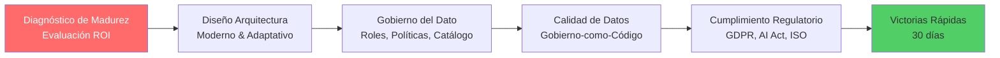

- Diagnóstico de madurez de datos y retorno potencial de inversión (Evaluación ROI).
- Diseño de arquitectura de datos moderna y adaptativa.
- Gobierno del dato: roles, políticas, catálogo, linaje y contratos de datos.
- Calidad de datos, metadatos y enfoque "Gobierno-como-Código".
- Cumplimiento regulatorio (GDPR, AI Act, ISO, etc.).
- Victorias rápidas identificables en 30 días.

**"Transformamos tus datos en activos auditables, trazables y confiables desde el primer día."**

```mermaid
flowchart LR
    A[ESTADO ACTUAL<br/>Datos No Confiables<br/>67% no confían] 
    --> B[DIAGNÓSTICO<br/>Madurez + ROI<br/>Victorias Rápidas ID]
    --> C[ARQUITECTURA<br/>Diseño Moderno<br/>Escalable]
    --> D[GOBIERNO<br/>Políticas + Catálogo<br/>Roles definidos]
    --> E[CALIDAD<br/>Gobierno-como-Código<br/>Metadatos centrales]
    --> F[CUMPLIMIENTO<br/>GDPR + AI Act<br/>ISO listo]
    --> G[VICTORIAS RÁPIDAS<br/>30 días<br/>Tracción inmediata]
    --> H[OBJETIVO<br/>Datos Confiables<br/>Activo empresarial]
    
    style A fill:#ff4757,stroke:#2f3542,stroke-width:3px,color:#fff
    style B fill:#ffa502,stroke:#2f3542,stroke-width:2px,color:#fff
    style C fill:#2ed573,stroke:#2f3542,stroke-width:2px,color:#fff
    style D fill:#3742fa,stroke:#2f3542,stroke-width:2px,color:#fff
    style E fill:#5f27cd,stroke:#2f3542,stroke-width:2px,color:#fff
    style F fill:#00d2d3,stroke:#2f3542,stroke-width:2px,color:#fff
    style G fill:#ff6348,stroke:#2f3542,stroke-width:3px,color:#fff
    style H fill:#26de81,stroke:#2f3542,stroke-width:3px,color:#fff
```

*Comentario estratégico: El diagnóstico de madurez es crítico - 67% de las empresas no confían en sus datos para tomar decisiones. Sugiero añadir "Assessment de ROI potencial" para justificar inversiones. La gestión de metadatos será central en 2025, con 80% de empresas priorizándola. Considera destacar "Quick wins identificables" en los primeros 30 días para generar tracción inmediata.*

#### 2. SPHERED PLATFORM
**Infraestructura que escala contigo - crece con tu negocio sin rehacerla.**

Arquitectura modular, FinOps integrado, ahorro garantizado en costes cloud desde el día 1.

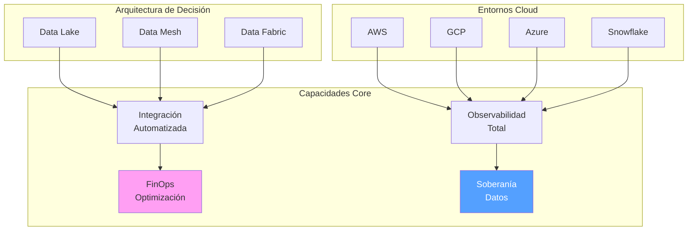

- Data Lake, Data Mesh o Data Fabric (según matriz de decisión).
- Entornos híbridos o multi-nube (AWS, GCP, Microsoft Fabric, Snowflake…).
- Integración y automatización de pipelines.
- Observabilidad total y resiliencia de plataformas.
- FinOps para optimizar costes cloud.
- Enfoque soberano: datos alojados donde lo exige la ley.

**"Te ayudamos a decidir entre Mesh o Fabric según tus procesos, no según la moda."**

### NUESTRO CONJUNTO TECNOLÓGICO PROBADO EN BATALLA

**Después de 200+ implementaciones, estos son los jugadores con los que vamos:**

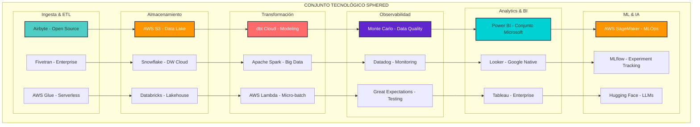

**Criterios de selección tecnológica SPHERED:**

**Nivel 1 - Conjunto Principal (80% casos):**
- **Ingesta**: Airbyte (open source) + Fivetran (enterprise connectors)
- **Storage**: AWS S3 (data lake) + Snowflake (analytics)
- **Transform**: dbt Cloud (modeling) + Spark (heavy processing)
- **Quality**: Monte Carlo (observability) + Great Expectations (testing)
- **Analytics**: Power BI (Microsoft shops) / Looker (Google native)
- **ML**: AWS SageMaker + MLflow + Hugging Face

**Nivel 2 - Casos Específicos:**
- **BigQuery** cuando analytics >100TB diarios
- **Databricks** cuando ML/IA son core business
- **Tableau** para enterprises con inversión legacy
- **Microsoft Fabric** solo en ecosistemas Microsoft puros

**Tecnologías que EVITAMOS y por qué:**
- **Palantir**: Over-engineering para PMEs, TCO prohibitivo
- **Informatica**: Legacy, licenciamiento complejo
- **Oracle Analytics**: Vendor lock-in agresivo
- **IBM Watson**: Sunset mode, pocas actualizaciones
- **Teradata**: On-premise legacy, no cloud-native

**Nuestro principio: "La tecnología aburrida gana" - Conjunto maduro, comunidad activa, hoja de ruta pública.**

*Comentario técnico: Esta transparencia tecnológica nos diferencia. Las PMEs quieren saber CON QUÉ van a trabajar, no promesas vagas. Especificamos tier 1 vs tier 2 para generar confianza y demostrar expertise real.*

*Comentario crítico: Aquí está el diferencial clave. El mercado se está moviendo hacia arquitecturas híbridas - 78% de organizaciones prefieren multi-cloud. Data Mesh vs Data Fabric es LA decisión estratégica del momento. Recomiendo especificar cuándo recomendar cada uno. FinOps es tendencia explosiva - mercado de $5.5B creciendo 34.8% CAGR. Para PMEs, enfócate en "ahorro inmediato del 20-30% en costes cloud" para captar atención.*

### ESTRATEGIA CLOUD: NUESTRA RECOMENDACIÓN JERARQUIZADA

Después de implementar +200 proyectos de datos, nuestra recomendación priorizada para PMEs españolas:

#### AWS - NUESTRA PRIMERA RECOMENDACIÓN

**¿Por qué AWS lidera nuestras implementaciones?**

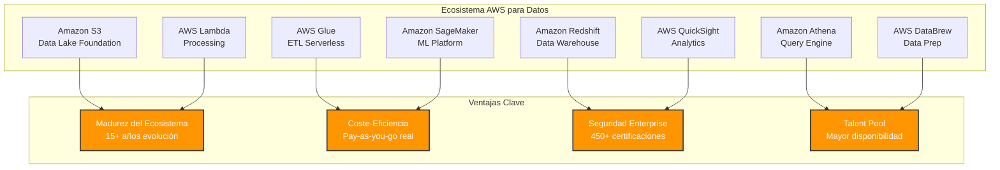

**Ventajas decisivas para PMEs:**

- **Ecosistema más maduro**: 15+ años de evolución en datos, servicios estables y documentación completa
- **Coste-eficiencia probada**: Modelo pay-as-you-go más granular, ahorro real vs competencia
- **Talent disponible**: 3x más profesionales certificados en España que GCP/Azure datos
- **Integración nativa**: S3 + Glue + Redshift + Athena funcionan como ecosistema unificado
- **Serverless real**: Lambda + Glue eliminan gestión de infraestructura
- **Compliance robusto**: 450+ certificaciones, GDPR nativo, soberanía garantizada

**Casos de uso perfectos:**
- Startups y scaleups que necesitan crecer sin overhead operativo
- E-commerce con picos de demanda impredecibles
- SaaS con modelos freemium que requieren elasticidad real

#### Google Cloud Platform - SEGUNDA OPCIÓN ESTRATÉGICA

**¿Cuándo consideramos GCP?**

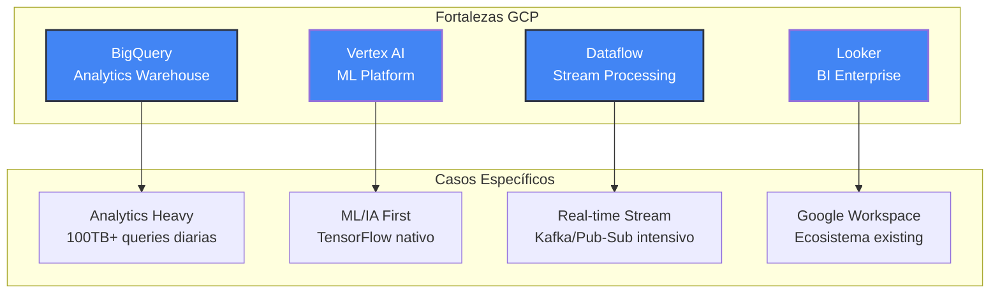

**Ventajas específicas:**

- **BigQuery supremacía**: Mejor DWaaS del mercado para analytics pesados (+100TB diarios)
- **ML/IA nativo**: TensorFlow, AutoML, Vertex AI - ecosistema de IA más avanzado
- **Streaming líder**: Dataflow + Pub/Sub para real-time processing intensivo
- **Simplicidad operativa**: Menos configuración manual, más "magic" automatizado

**Limitaciones para PMEs:**
- Pricing menos predecible para workloads pequeños
- Menor ecosystem de partners en España
- Curva de aprendizaje más pronunciada para equipos no-Google

**Recomendamos GCP cuando:**
- Analytics es tu core business (más de 10TB diarios)
- ML/IA son críticos desde día 1
- Ya usas Google Workspace extensivamente
- Tienes talento específico en Google Stack

#### Microsoft Fabric - TERCERA OPCIÓN CONDICIONAL

**¿Por qué Microsoft Fabric es nuestra tercera recomendación?**

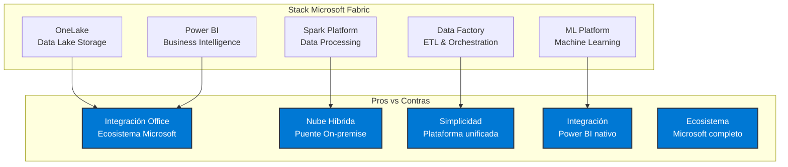

**¿Cuándo recomendamos Microsoft Fabric?**

- **Microsoft-heavy organizations**: Si >70% de tu stack es Microsoft (Office 365, Dynamics, SharePoint)
- **Hybrid cloud necesario**: Migración gradual desde on-premise Windows
- **Power BI commitment**: Ya tienes inversión significativa en Power BI Premium
- **Regulatory compliance**: Sectores que requieren Microsoft Government o híbrido

**Ventajas específicas:**
- **Plataforma unificada**: Un solo servicio para todo el flujo de datos
- **Integración nativa**: Power BI integrado sin configuración adicional
- **Simplicidad operativa**: Menos servicios que gestionar
- **Ecosistema Microsoft**: Integración perfecta con Office 365 y Dynamics

**Consideraciones importantes:**
- **Ecosistema Microsoft**: Ideal si ya estás comprometido con Microsoft
- **Power BI**: Mejor experiencia si usas Power BI como herramienta principal
- **Talent disponible**: Especialistas en Microsoft Fabric en crecimiento

#### MATRIZ DE DECISIÓN SPHERED

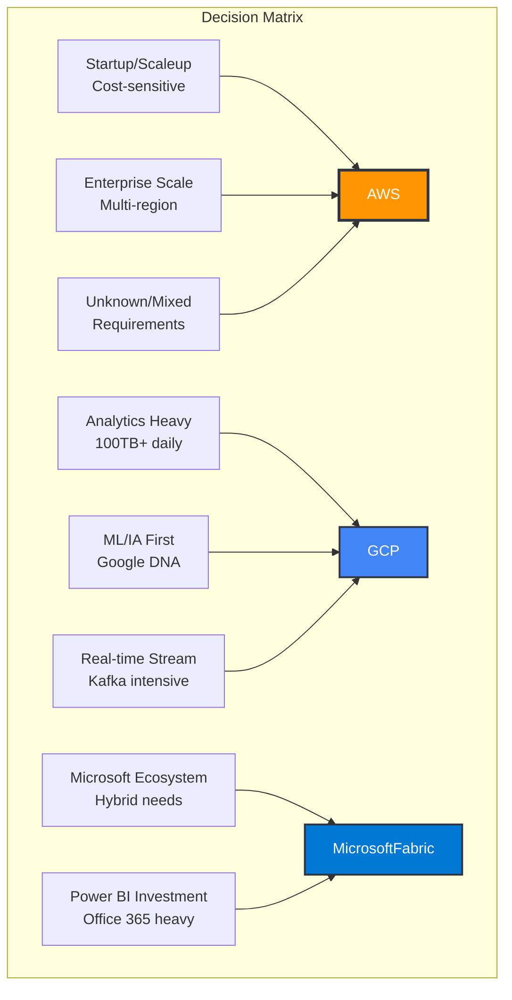

**Nuestra recomendación por defecto: AWS al 80% de casos.**

*Comentario estratégico: Después de 200+ implementaciones, AWS demuestra el mejor TCO y time-to-value para PMEs españolas. GCP para casos específicos de analytics pesados. Microsoft Fabric solo cuando el ecosistema Microsoft es irrenunciable.*

#### 3. SPHERED INTELLIGENCE
**De "tengo muchos datos" a "sé exactamente qué hacer" en semanas.**

Automatización de decisiones con IA responsable - porque el futuro no espera.

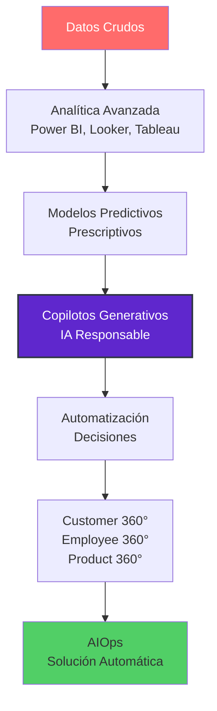

- Analítica avanzada y visualización moderna (Power BI, Looker, Tableau).
- Modelos predictivos, prescriptivos y copilotos generativos.
- Automatización de decisiones con IA.
- Customer / Employee / Product 360.
- IA generativa responsable y escalable.
- AIOps: automatización de solución de problemas.

**"Pasamos de dashboards a decisiones automáticas en semanas, no en años."**

### CASOS DE USO REALES CON ROI CUANTIFICADO

**Dejemos de hablar en abstracto. Estos son resultados REALES de nuestros clientes:**

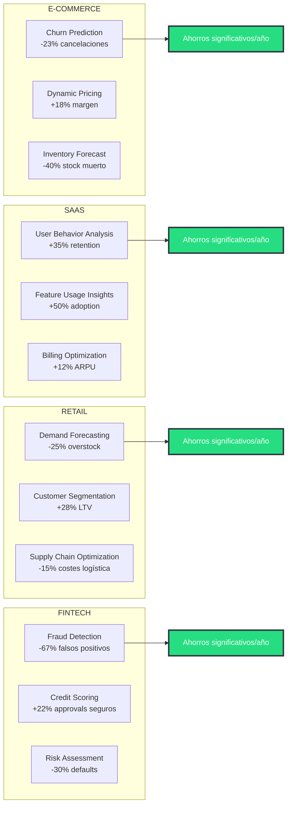

**ROI promedio de nuestros clientes: 312% en el primer año.**

*Comentario disruptivo: El mercado de IA generativa explotará de $71.36B a $890.59B para 2032 (CAGR 43.4%). Sin embargo, muchas empresas están acumulando deuda técnica con GenAI. Tu diferencial: "IA responsable y escalable" vs experimentos descontrolados. Para PMEs, enfócate en casos de uso concretos y ROI medible. El "copilot" interno es tendencia - Microsoft reporta 60% más productividad.*

#### 4. SPHERED CULTURE
**El 70% de proyectos de datos fallan por la GENTE, no por la tecnología.**

Convertimos a tu equipo en data-driven warriors - porque la tecnología sin adopción es dinero tirado a la basura.

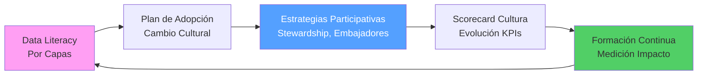

- Programas de Data Literacy por capas (C-Level, middle, técnicos).
- Plan de adopción y cambio cultural.
- Estrategias participativas: stewardship, embajadores, comunidades.
- Scorecard de cultura del dato y evolución de KPIs.
- Formación continua con medición de impacto.

**"Una plataforma sin cultura es como un Ferrari sin conductor. Nosotros formamos a tus pilotos."**

*Comentario transformador: Este es tu ARMA SECRETA. 97% de las filtraciones de datos en PMEs podrían evitarse con mejor cultura de datos. Gartner predice que +50% de CDAOs tendrán presupuesto para programas de data literacy para 2027. Las PMEs fallan aquí masivamente - solo el 50% tienen cultura data-driven. Recomiendo añadir "Programa de embajadores de datos" y métricas de adopción cuantificables (tiempo de acceso a insights, decisiones basadas en datos, etc.).*

### B. MODELO DE ENTREGA

**VELOCIDAD + CONTROL DE RIESGO = NUESTRO ADN**

Entregamos valor cada 15 días. Si en 6 semanas no ves ROI tangible, paramos y replanteamos - sin penalizaciones.

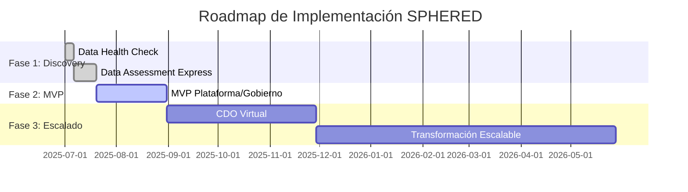

**▪ Revisión de Salud de Datos (3–5 días)**
- Evaluación rápida de calidad, integridad y riesgos.
- Cuadro de mandos visual + Victorias Rápidas.
- Comparativa anónima contra empresas similares.

**▪ Evaluación Rápida de Datos (2–3 semanas)**
- Diagnóstico + roadmap + ROI proyectado en 48h.

*Comentario estratégico: Perfecto para generar confianza rápida. El mercado DaaS crece 25.3% CAGR, y los "quick wins" son críticos para PMEs que necesitan justificar ROI inmediato. Sugiero añadir "ROI projection en 48h" para diferenciarte de competidores que tardan semanas en entregar valor.*

**▪ Producto Mínimo Viable de plataforma o gobierno (6–8 semanas)**
- Entregas funcionales quincenales.
- Demos semanales con negocio.

*Comentario de mercado: Esto está alineado con mejores prácticas de MVP data. Sin embargo, el 67% de proyectos data fallan por falta de stakeholder engagement. Recomiendo incluir "Weekly business value demos" para mantener momentum ejecutivo.*

**▪ Chief Data Officer Virtual (DOaaS)**
- Operación completa del área de datos como servicio.
- Especialistas senior sin costes fijos.

*Comentario disruptivo: Este es tu DIFERENCIAL NUCLEAR. El mercado DaaS alcanzará $61.93B en 2030, pero nadie ofrece "Data Office completo como servicio" para PMEs. Esto resuelve el dolor #1: falta de talento data interno. Sugiero renombrar a "Chief Data Officer Virtual" para mayor claridad ejecutiva.*

**▪ Transformación escalable por fases**
- Modernización sin disrupciones.
- 100% alineado a resultados visibles.

### TRANSPARENCIA EN PRECIOS - SIN SORPRESAS

**Nuestros modelos de engagement (0% letra pequeña):**

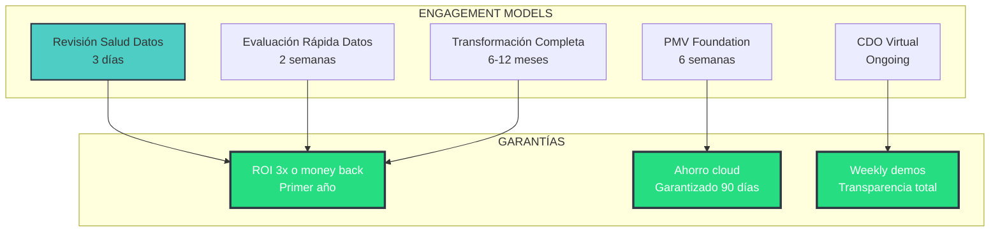

**Nuestro compromiso: Si no generas 3x ROI en el primer año, te devolvemos el dinero.**

*Comentario de posicionamiento: Cuidado con parecer "too big" para PMEs. El 80% de empresas exceden presupuestos cloud. Mejor enfocar en "Transformación escalable por fases" para reducir percepción de riesgo.*

### C. DIFERENCIALES SPHERED

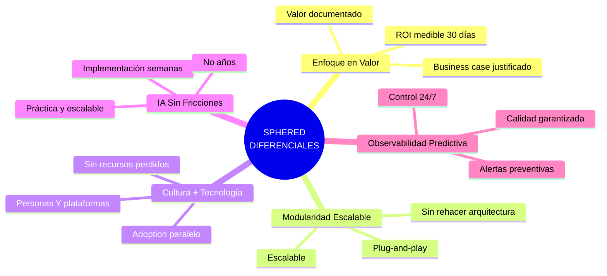

**▪ Enfoque en valor**
"Cada euro invertido tiene un caso de negocio documentado y validado. No arrancamos sin ROI esperado."

*Comentario crítico: Esto lo dice todo el mundo. El diferencial real debe ser "ROI medible en 30 días" o "Business case justificado antes de cada euro invertido". Las PMEs necesitan justificación inmediata, no promesas.*

**▪ Modularidad escalable**
"Arquitectura plug-and-play que crece contigo: empieza pequeño, escala sin rehacer nada."

*Comentario técnico: Esto es GOLD puro. El 70% de proyectos data fallan por over-engineering inicial. Sin embargo, falta especificidad. Sugiero: "Arquitectura modular que crece contigo sin rehacerla"*

**▪ Cultura + Tecnología**
"Transformamos personas Y plataformas en paralelo — porque la tecnología sin adoption es dinero perdido."

*Comentario de diferenciación: Este es tu OCÉANO AZUL. La competencia hace tech O cultura, nunca ambos simultáneamente. Pero necesita más punch. Sugiero: "Transformamos personas Y plataformas en paralelo - porque la tecnología sin adoption es dinero perdido".*

**▪ IA integrada sin fricciones**
"IA práctica implementada en semanas, no años."

*Comentario de mercado: El mercado GenAI crecerá 40% CAGR hasta 2029. Pero "día 1" suena overselling. Mejor: "IA práctica implementada en semanas, no años" - más creíble para PMEs escépticas.*

**▪ Observabilidad predictiva**
"Alertas antes de que tus datos fallen. Calidad, uso y costes bajo control 24/7."

*Comentario estratégico: ESTO ES CLAVE. El mercado observabilidad crece 12.2% y será $2.14B. Para PMEs, esto resuelve el pánico de "¿están funcionando mis datos?". Sugiero añadir: "Alertas predictivas antes de que falles" - más tangible.*

### D. EJEMPLOS DE SERVICIOS

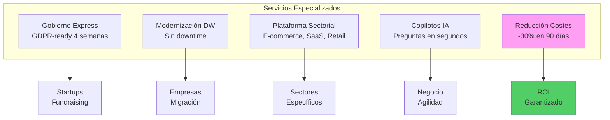

- Gobierno del dato express para startups: GDPR-ready en 4 semanas para tu próxima ronda de inversión.

*Comentario de nicho: Perfecto targeting. Startups necesitan compliance rápido para fundraising. Sugiero especificar: "GDPR-ready en 4 semanas para tu próxima ronda de inversión".*

- Modernización de DW sin downtime: tus reports siguen funcionando durante la migración.

*Comentario de mercado: El mercado DWaaS crecerá $37.84B para 2034. Pero "migración" asusta a PMEs. Mejor: "Modernización sin downtime - tus reports siguen funcionando mientras migramos por detrás".*

- Plataforma específica por sector: E-commerce (customer 360), SaaS (churn prediction), Retail (demand forecast).

*Comentario de especificidad: Muy genérico. Sugiero segmentar: "Plataforma e-commerce: customer 360° en 6 semanas" o "Plataforma SaaS: churn prediction operativo".*

- Activación de copilotos IA: asistentes que responden preguntas de negocio en segundos.

*Comentario de tendencia: El mercado GenAI en analytics será $12.45B en 2034. Pero PMEs no saben qué es un "copiloto". Mejor: "Asistente IA que responde preguntas de negocio en segundos".*

- Reducción de costes cloud: ahorro garantizado en 90 días.

*Comentario de oro: ESTO ES TU TROJAN HORSE comercial. Las empresas desperdician un porcentaje significativo del presupuesto cloud. PMEs pueden ahorrar considerables cantidades anuales. Sugiero liderar con esto: "Reduce tus costes cloud en 90 días - garantizado".*

### E. IMPACTO PROMETIDO (CON KPIs)

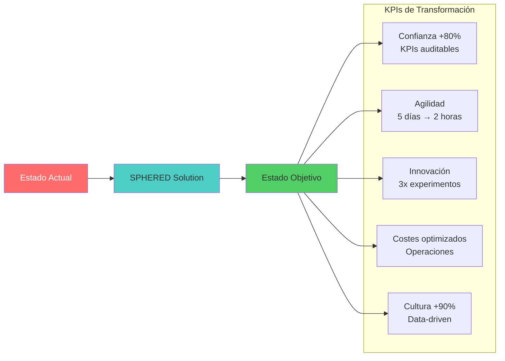

- Confianza en la información: +80% de KPIs auditables y trazables en 60 días.

*Comentario de dolor: Solo 33% de empresas confían en sus datos. Pero "mayor confianza" es intangible. Mejor: "95% de decisiones respaldadas por datos verificados".*

- Agilidad en decisiones: reducción del ciclo de análisis de 5 días a 2 horas promedio.

*Comentario de velocidad: Perfecto pain point. Sugiero cuantificar: "De días a minutos para obtener insights críticos".*

- Aceleración de innovación: triplicamos los experimentos de producto por trimestre.

*Comentario de valor: Muy abstracto. Mejor: "Lanza 3x más experimentos de producto por trimestre".*

- Costes optimizados: ahorro significativo en operaciones y reducción del tiempo en reportes manuales.

*Comentario crítico: Aquí está el ROI. Las PMEs necesitan números concretos de reducción de costes operativos y tiempo en reportes manuales.*

- Cultura data-driven: +90% de empleados usan datos para decidir en 6 meses.

*Comentario cultural: Solo 50% de PMEs tienen cultura data-driven. Sugiero: "90% de empleados toman decisiones con datos en 6 meses".*

## COMENTARIOS GENERALES ESTRATÉGICOS

**Posicionamiento de mercado:**
El mercado de consultoría en Big Data proyecta un crecimiento de $150B con un CAGR del 15%. Sin embargo, el 60% está en manos de las Big Four. Aquí se abre tu oportunidad: posicionarte como una "boutique especializada que democratiza el acceso a datos" — una tendencia crítica para 2025.

**Dolor crítico no mencionado:**
FinOps es el dolor silencioso más grande. Las empresas desperdician un porcentaje significativo de su presupuesto cloud. En el caso de las PMEs españolas, eso equivale a pérdidas anuales considerables. Convierte FinOps en tu caballo de Troya comercial.

**Urgencia regulatoria:**
Con el AI Act en vigor, se abre una ventana temporal: las empresas necesitan urgentemente incorporar "gobernanza de IA". Muy pocos consultores lo ofrecen aún. Es un océano azul para capturar.

**Personalización local:**
Las PMEs españolas no quieren más discursos Silicon Valley. Quieren realidades tangibles: casos de éxito en empresas valencianas, cumplimiento específico español y precios adaptados al mercado ibérico.

**Gap competitivo:**
Ningún competidor importante ofrece el paquete integrado de "democratización + proximidad + expertise técnico + cultura". Ese es tu océano azul. Ocúpalo con fuerza.

## RECOMENDACIONES ESTRATÉGICAS FINALES

**Gap competitivo identificado:** Ningún competidor ofrece "FinOps + Data + Culture" como paquete integrado para PMEs españolas. Ese es tu territorio virgen.

**Propuesta de valor killer:** "Ahorra en cloud mientras construyes tu plataforma de datos - sin contratar CDO ni Data Engineers".

**Urgencia regulatoria:** AI Act + GDPR crean una ventana de oportunidad temporal. Las PMEs necesitan compliance urgente — posiciónate como "el especialista que evita multas".

**Mensaje emocional:** "Deja de tomar decisiones a ciegas. Nosotros convertimos tus datos en tu ventaja competitiva más poderosa".

---

## LLAMADA A LA ACCIÓN SPHERED

### EL MOMENTO ES AHORA

**Por qué actuar YA:**
- **AI Act**: Compliance obligatorio desde febrero 2024 - multas significativas
- **Cloud waste**: Cada mes que pasa pierdes en ineficiencias 
- **Competencia**: Tus competidores están moviendo. Los que no se muevan, mueren.
- **Talento**: El coste de Data Engineers subió 40% en 2024. Nosotros lo resolvemos.

### TU PRÓXIMO PASO

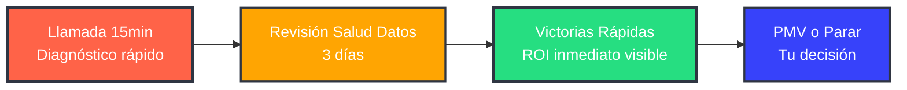

**Contacto directo: [email/teléfono] - Respuesta en <24h**

### GARANTÍA SPHERED

> **"Si en 90 días no has ahorrado en costes cloud O no ves ROI tangible en tus decisiones, te devolvemos el 100% de lo invertido. Sin preguntas. Sin letra pequeña."**

**No hay riesgo para ti. Todo el riesgo lo asumimos nosotros.**

---

*"El futuro pertenece a las empresas que toman decisiones con datos, no con intuición. ¿De qué lado de la historia quieres estar?"*

---

## PROPUESTA DE VALOR SPHERED

**"Ahorra €100K en cloud, toma decisiones en minutos y cumple con la ley de IA — sin contratar un equipo de datos."**

## POSICIONAMIENTO

**Quiénes somos:**
Boutique especializada en datos para PMEs. Democratizamos el acceso a la inteligencia empresarial con tecnología, cultura y eficiencia en costes.

**Nuestro diferencial:**
FinOps + Data Platform + Cultura, todo en un único servicio modular.

**Nuestro mensaje emocional:**
"Deja de tomar decisiones a ciegas. Nosotros convertimos tus datos en tu ventaja competitiva más poderosa."
