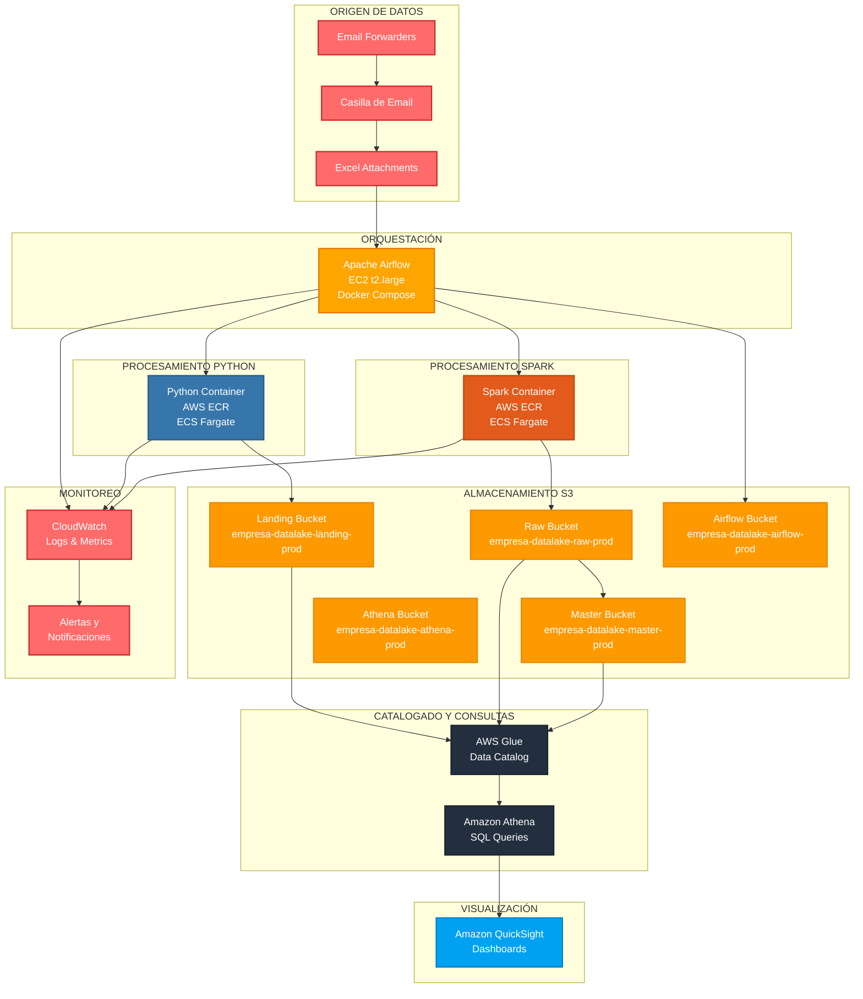
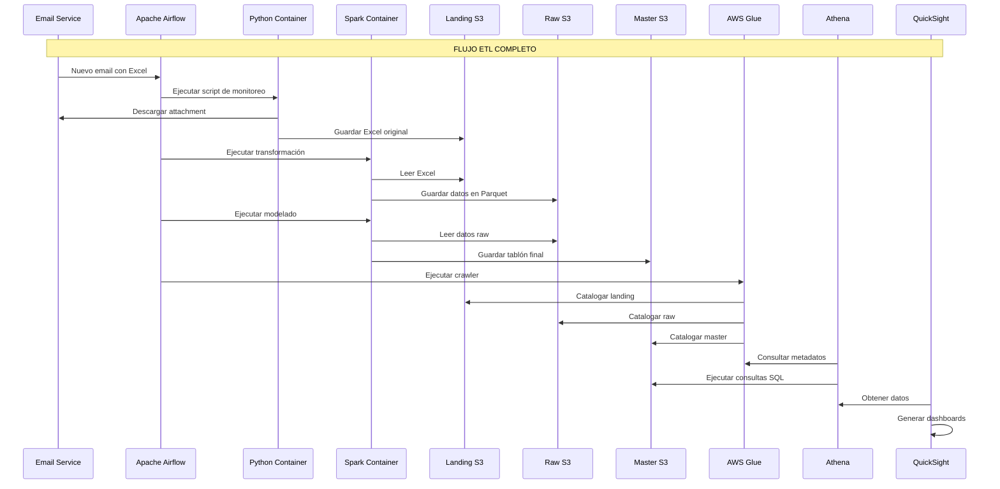
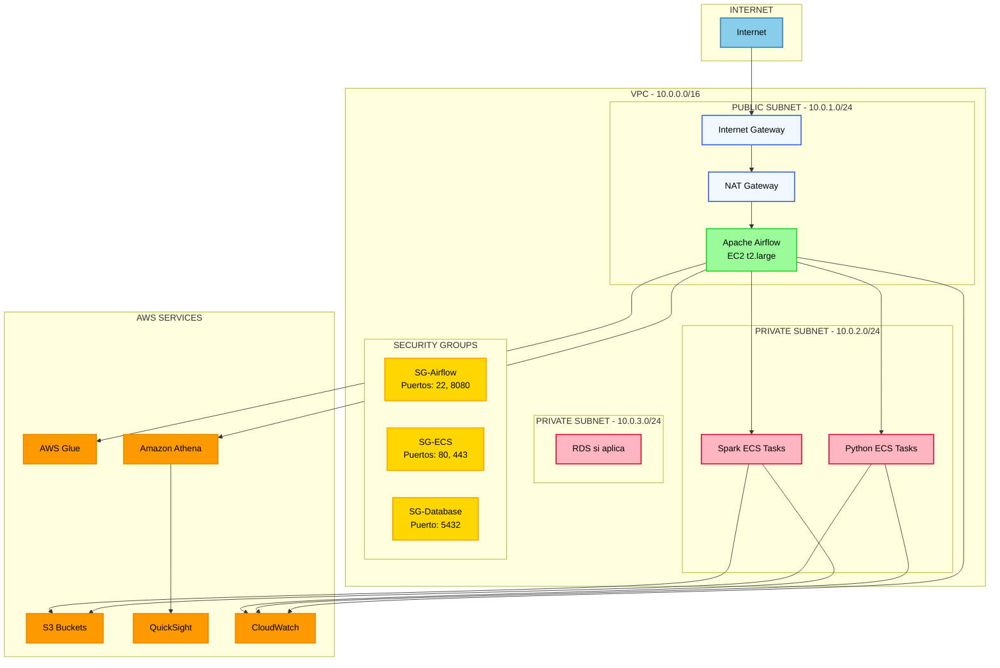

# Arquitectura de Datalake/Datawarehouse en AWS

## Descripción del Proyecto

Este proyecto implementa una arquitectura completa de datalake y datawarehouse en AWS para el procesamiento de datos empresariales. La solución incluye orquestación con Apache Airflow, procesamiento de datos con Python y Spark, almacenamiento en S3, catalogado con AWS Glue, consultas con Athena, y visualización con Amazon QuickSight.

## 📅 Cronograma del Proyecto

### **🚀 Resumen del Cronograma**
- **Fecha de Inicio**: Lunes 25 de Agosto de 2025
- **Fecha de Finalización**: Viernes 31 de Octubre de 2025
- **Duración Total**: 10 semanas (2.5 meses)

### **📊 Fases del Proyecto**

#### **🏗️ FASE 1: INFRAESTRUCTURA BASE (Semanas 1-5)**
- **Semana 1-2**: Configuración AWS (25 Ago - 8 Sep)
- **Semana 3-4**: Construcción Data Lake (9 Sep - 22 Sep)
- **Semana 5**: Arquitectura de Almacenamiento (23 Sep - 6 Oct)

#### **🔄 FASE 2: DESARROLLO ETL (Semanas 6-8)**
- **Semana 6**: Desarrollo ETL inicial - Recepción emails y extracción Excel (7 Oct - 13 Oct)
- **Semana 7**: Desarrollo ETL intermedio - Transformación y catalogación (14 Oct - 20 Oct)
- **Semana 8**: Desarrollo ETL final - Pipeline optimizado (21 Oct - 27 Oct)

#### **🧪 FASE 3: PRUEBAS Y DASHBOARD (Semanas 9-10)**
- **Semana 9**: Pruebas finales y ajustes (28 Oct - 30 Oct)
- **Semana 10**: Dashboard QuickSight y despliegue final (31 Oct)

### **👥 Equipo del Proyecto**
- **🏗️ Arquitecto Infraestructura**: Configuración AWS, construcción del Data Lake, arquitectura de almacenamiento
- **🔧 Arquitecto ETL**: Desarrollo completo del pipeline ETL, transformaciones y catalogación
- **📊 Arquitecto Analytics**: Pruebas, validación, dashboard QuickSight y despliegue final

### **🎯 Hitos del Proyecto**
- **🏆 Hito 1**: 6 Octubre 2025 - Infraestructura AWS completamente configurada
- **🚀 Hito 2**: 27 Octubre 2025 - Pipeline ETL funcionando y procesando datos
- **🎉 Hito 3**: 31 Octubre 2025 - Sistema completo en producción con dashboard activo

## Arquitectura del Sistema

### Diagrama de Arquitectura General



### Flujo de Datos ETL



### Arquitectura de Red y Seguridad



## Componentes Principales

### 1. Orquestación - Apache Airflow
- **Ubicación**: EC2 t2.large con Docker Compose
- **Función**: Programación y monitoreo de workflows ETL
- **Características**: 
  - Monitoreo de emails cada 1 hora
  - Ejecución de tareas Python y Spark
  - Gestión de dependencias entre tareas
  - Alertas y notificaciones

### 2. Procesamiento Python
- **Contenedor**: Docker en AWS ECR
- **Orquestación**: ECS Fargate
- **Funciones**:
  - Monitoreo de casilla de email
  - Descarga de attachments Excel
  - Ingesta en bucket Landing
  - Validación de datos

### 3. Procesamiento Spark
- **Contenedor**: Docker con Java 11 y Spark 3.5.2
- **Orquestación**: ECS Fargate
- **Funciones**:
  - Transformación de datos Excel
  - Conversión a formato Parquet
  - Modelado de datos finales
  - Escritura en bucket Master

### 4. Almacenamiento S3
- **Landing**: Datos originales sin modificar (100GB)
- **Raw**: Datos transformados en Parquet (100GB)
- **Master**: Tablones finales modelados (100GB)
- **Airflow**: DAGs, configuraciones y logs (100GB)
- **Athena**: Resultados de consultas (100GB)

### 5. Catalogado y Consultas
- **AWS Glue**: Metadatos y catálogo de datos
- **Amazon Athena**: Consultas SQL sobre S3
- **Crawlers**: Catalogado automático de nuevos datos

### 6. Visualización
- **Amazon QuickSight**: Dashboards interactivos (2 usuarios iniciales)
- **Integración**: Conexión directa con Athena
- **SPICE Storage**: 5GB para almacenamiento de datos

## Flujo de Email ETL

### Configuración de Forwarders
1. **Email Principal**: `datos@empresa.com`
2. **Forwarders**: 
   - `forwarder1@empresa.com` → Envía Excel A
   - `forwarder2@empresa.com` → Envía Excel B
3. **Frecuencia**: Monitoreo cada 1 hora
4. **Procesamiento**: Automático con Airflow

### Pipeline de Datos
```
Email → Python Script → Landing S3 → Spark Transform → Raw S3 → Spark Model → Master S3 → Glue Catalog → Athena → QuickSight
```

## Requisitos Técnicos

### EC2 t2.large
- **CPU**: 2 vCPUs
- **RAM**: 8 GB
- **Storage**: 50 GB EBS GP3
- **OS**: Amazon Linux 2 o Ubuntu 20.04

### Docker Compose
- **Airflow**: 2.8.0
- **PostgreSQL**: 13
- **Redis**: 7.2
- **Volúmenes**: DAGs, logs, config, plugins

### Contenedores ECS
- **Python**: 3.11-slim con dependencias
- **Spark**: 3.5.2 con Java 11
- **Recursos**: Configurables por tarea

## Monitoreo y Alertas

### CloudWatch
- **Logs**: Centralización de logs de todos los servicios
- **Métricas**: CPU, memoria, almacenamiento, latencia
- **Alertas**: Notificaciones por email/SMS
- **Dashboards**: Visualización de métricas en tiempo real

### Airflow
- **Task Status**: Estado de cada tarea ETL
- **DAG Runs**: Historial de ejecuciones
- **SLA Monitoring**: Alertas por incumplimiento de SLAs
- **Email Notifications**: Notificaciones automáticas

## Seguridad y Compliance

### IAM y Roles
- **Principle of Least Privilege**: Acceso mínimo necesario
- **Service Roles**: Roles específicos para cada servicio
- **Cross-Account Access**: Si se requiere multi-cuenta

### VPC y Networking
- **Private Subnets**: Para tareas ECS sensibles
- **Security Groups**: Restricción de tráfico
- **NAT Gateway**: Acceso controlado a internet

### Data Encryption
- **S3**: Encriptación en reposo (AES-256)
- **Transit**: TLS 1.2+ para transferencias
- **KMS**: Gestión de claves de encriptación

## Escalabilidad y Performance

### Auto-scaling
- **ECS Fargate**: Escalado automático basado en demanda
- **S3**: Escalado automático del almacenamiento
- **Athena**: Procesamiento paralelo de consultas

### Optimizaciones
- **Parquet**: Formato columnar para consultas eficientes
- **Partitioning**: Particionado por fecha en S3
- **Compression**: Compresión de datos para reducir costos

## Implementación y Deployment

### Fases del Proyecto
1. **Setup AWS** (1-2 semanas)
2. **Infraestructura** (2-3 semanas)
3. **Desarrollo ETL** (4-6 semanas)
4. **Integración** (2-3 semanas)
5. **Testing** (2-3 semanas)
6. **Deployment** (1-2 semanas)
7. **Capacitación** (1 semana)
8. **Soporte Post-Implementación** (1 mes)

### CI/CD Pipeline
- **GitHub Actions**: Automatización de despliegues
- **Docker Builds**: Construcción automática de imágenes
- **Testing**: Pruebas automáticas antes del despliegue
- **Rollback**: Capacidad de revertir cambios

## Documentación y Capacitación

### Documentación Técnica
- **Arquitectura**: Diagramas y especificaciones técnicas
- **Operaciones**: Runbooks y procedimientos
- **API**: Documentación de interfaces
- **Troubleshooting**: Guías de resolución de problemas
