# 🏗️ Arquitectura de Datalake/Datawarehouse en AWS

## 📋 Descripción del Proyecto

Este proyecto implementa una arquitectura completa de datalake y datawarehouse en AWS para el procesamiento de datos empresariales. La solución incluye orquestación con Apache Airflow, procesamiento de datos con Python y Spark, almacenamiento en S3, catalogado con AWS Glue, consultas con Athena, y visualización con Amazon QuickSight.

## 📊 Cotización Detallada

El archivo `cotizacion_datalake_aws.csv` contiene una cotización completa e itemizada que incluye:

### 💰 **Resumen de Costos**

| Categoría | Costo AWS Mensual (EUR) | Mano de Obra (EUR) | Total (EUR) |
|-----------|-------------------------|-------------------|-------------|
| **SETUP INICIAL AWS** | 0.00 | 1,320.00 | 1,320.00 |
| **INFRAESTRUCTURA COMPUTE** | 74.79 | 0.00 | 74.79 |
| **ALMACENAMIENTO S3** | 102.30 | 0.00 | 102.30 |
| **CONTENEDORES** | 1.00 | 0.00 | 1.00 |
| **CATALOGADO Y CONSULTAS** | 2,505.88 | 0.00 | 2,505.88 |
| **VISUALIZACIÓN** | 45.25 | 0.00 | 45.25 |
| **REDES Y SEGURIDAD** | 45.00 | 0.00 | 45.00 |
| **MONITOREO Y LOGS** | 26.30 | 0.00 | 26.30 |
| **DESARROLLO ETL** | 0.00 | 7,440.00 | 7,440.00 |
| **INTEGRACIÓN** | 0.00 | 1,680.00 | 1,680.00 |
| **TESTING Y VALIDACIÓN** | 0.00 | 2,160.00 | 2,160.00 |
| **DEPLOYMENT** | 0.00 | 2,160.00 | 2,160.00 |
| **CAPACITACIÓN** | 0.00 | 1,680.00 | 1,680.00 |
| **SOPORTE Y MANTENIMIENTO** | 0.00 | 7,200.00 | 7,200.00 |
| **PROYECTO** | 0.00 | 10,960.00 | 10,960.00 |

**💰 TOTAL IMPLEMENTACIÓN: 37,000.00 EUR**  
**💰 TOTAL MENSUAL AWS: 2,800.00 EUR**

### 📈 **Desglose por Fases**

1. **Fase 1 - Setup Inicial (1-2 semanas)**: 1,320 EUR
2. **Fase 2 - Infraestructura (2-3 semanas)**: 74.79 EUR/mes
3. **Fase 3 - Desarrollo ETL (4-6 semanas)**: 7,440 EUR
4. **Fase 4 - Integración y Testing (2-3 semanas)**: 3,840 EUR
5. **Fase 5 - Deployment y Capacitación (1-2 semanas)**: 3,840 EUR
6. **Fase 6 - Soporte Post-Implementación (1 mes)**: 7,200 EUR

## 🏛️ Arquitectura del Sistema

### 🔄 **Diagrama de Arquitectura General**

```mermaid
graph TB
    subgraph "ORIGEN DE DATOS"
        A[📧 Email Forwarders] --> B[📨 Casilla de Email]
        B --> C[📎 Excel Attachments]
    end
    
    subgraph "ORQUESTACIÓN"
        D[🔄 Apache Airflow<br/>EC2 t2.large<br/>Docker Compose]
    end
    
    subgraph "PROCESAMIENTO PYTHON"
        E[🐍 Python Container<br/>AWS ECR<br/>ECS Fargate]
    end
    
    subgraph "PROCESAMIENTO SPARK"
        F[⚡ Spark Container<br/>AWS ECR<br/>ECS Fargate]
    end
    
    subgraph "ALMACENAMIENTO S3"
        G[📥 Landing Bucket<br/>empresa-datalake-landing-prod]
        H[🔄 Raw Bucket<br/>empresa-datalake-raw-prod]
        I[📊 Master Bucket<br/>empresa-datalake-master-prod]
        J[⚙️ Airflow Bucket<br/>empresa-datalake-airflow-prod]
        K[🔍 Athena Bucket<br/>empresa-datalake-athena-prod]
    end
    
    subgraph "CATALOGADO Y CONSULTAS"
        L[📚 AWS Glue<br/>Data Catalog]
        M[🔍 Amazon Athena<br/>SQL Queries]
    end
    
    subgraph "VISUALIZACIÓN"
        N[📈 Amazon QuickSight<br/>Dashboards]
    end
    
    subgraph "MONITOREO"
        O[📊 CloudWatch<br/>Logs & Metrics]
        P[🚨 Alertas y<br/>Notificaciones]
    end
    
    C --> D
    D --> E
    D --> F
    E --> G
    F --> H
    H --> I
    D --> J
    G --> L
    H --> L
    I --> L
    L --> M
    M --> N
    D --> O
    E --> O
    F --> O
    O --> P
    
    classDef email fill:#FF6B6B,stroke:#C92A2A,stroke-width:2px,color:#FFF
    classDef airflow fill:#FFA500,stroke:#E67700,stroke-width:2px,color:#FFF
    classDef python fill:#3776AB,stroke:#2E5A88,stroke-width:2px,color:#FFF
    classDef spark fill:#E25A1C,stroke:#B84A16,stroke-width:2px,color:#FFF
    classDef s3 fill:#FF9900,stroke:#E68900,stroke-width:2px,color:#FFF
    classDef aws fill:#232F3E,stroke:#1A2530,stroke-width:2px,color:#FFF
    classDef viz fill:#00A1F1,stroke:#0081C8,stroke-width:2px,color:#FFF
    classDef monitor fill:#FF6B6B,stroke:#C92A2A,stroke-width:2px,color:#FFF
    
    class A,B,C email
    class D airflow
    class E python
    class F spark
    class G,H,I,J,K s3
    class L,M aws
    class N viz
    class O,P monitor
```



### 🔄 **Flujo de Datos ETL**

```mermaid
sequenceDiagram
    participant Email as 📧 Email Service
    participant Airflow as 🔄 Apache Airflow
    participant Python as 🐍 Python Container
    participant Spark as ⚡ Spark Container
    participant Landing as 📥 Landing S3
    participant Raw as 🔄 Raw S3
    participant Master as 📊 Master S3
    participant Glue as 📚 AWS Glue
    participant Athena as 🔍 Athena
    participant QuickSight as 📈 QuickSight
    
    Note over Email,QuickSight: FLUJO ETL COMPLETO
    
    Email->>Airflow: 📨 Nuevo email con Excel
    Airflow->>Python: 🚀 Ejecutar script de monitoreo
    Python->>Email: 📥 Descargar attachment
    Python->>Landing: 💾 Guardar Excel original
    
    Airflow->>Spark: 🚀 Ejecutar transformación
    Spark->>Landing: 📖 Leer Excel
    Spark->>Raw: 💾 Guardar datos en Parquet
    
    Airflow->>Spark: 🚀 Ejecutar modelado
    Spark->>Raw: 📖 Leer datos raw
    Spark->>Master: 💾 Guardar tablón final
    
    Airflow->>Glue: 🔄 Ejecutar crawler
    Glue->>Landing: 📚 Catalogar landing
    Glue->>Raw: 📚 Catalogar raw
    Glue->>Master: 📚 Catalogar master
    
    Athena->>Glue: 🔍 Consultar metadatos
    Athena->>Master: 📊 Ejecutar consultas SQL
    
    QuickSight->>Athena: 📈 Obtener datos
    QuickSight->>QuickSight: 🎨 Generar dashboards
```



### 🏗️ **Arquitectura de Red y Seguridad**

```mermaid
graph TB
    subgraph "INTERNET"
        A[🌐 Internet]
    end
    
    subgraph "VPC - 10.0.0.0/16"
        subgraph "PUBLIC SUBNET - 10.0.1.0/24"
            B[🌐 Internet Gateway]
            C[🔒 NAT Gateway]
            D[🔄 Apache Airflow<br/>EC2 t2.large]
        end
        
        subgraph "PRIVATE SUBNET - 10.0.2.0/24"
            E[🐍 Python ECS Tasks]
            F[⚡ Spark ECS Tasks]
        end
        
        subgraph "PRIVATE SUBNET - 10.0.3.0/24"
            G[🗄️ RDS (si aplica)]
        end
        
        subgraph "SECURITY GROUPS"
            H[🔒 SG-Airflow<br/>Puertos: 22, 8080]
            I[🔒 SG-ECS<br/>Puertos: 80, 443]
            J[🔒 SG-Database<br/>Puerto: 5432]
        end
    end
    
    subgraph "AWS SERVICES"
        K[📦 S3 Buckets]
        L[📚 AWS Glue]
        M[🔍 Amazon Athena]
        N[📈 QuickSight]
        O[📊 CloudWatch]
    end
    
    A --> B
    B --> C
    C --> D
    D --> E
    D --> F
    E --> K
    F --> K
    D --> L
    D --> M
    M --> N
    D --> O
    E --> O
    F --> O
    
    classDef internet fill:#87CEEB,stroke:#4682B4,stroke-width:2px,color:#000
    classDef vpc fill:#F0F8FF,stroke:#4169E1,stroke-width:2px,color:#000
    classDef public fill:#98FB98,stroke:#32CD32,stroke-width:2px,color:#000
    classDef private fill:#FFB6C1,stroke:#DC143C,stroke-width:2px,color:#000
    classDef security fill:#FFD700,stroke:#FFA500,stroke-width:2px,color:#000
    classDef aws fill:#FF9900,stroke:#E68900,stroke-width:2px,color:#000
    
    class A internet
    class B,C,D,E,F,G vpc
    class D public
    class E,F,G private
    class H,I,J security
    class K,L,M,N,O aws
```

## 🚀 **Componentes Principales**

### 1. **Orquestación - Apache Airflow**
- **Ubicación**: EC2 t2.large con Docker Compose
- **Función**: Programación y monitoreo de workflows ETL
- **Características**: 
  - Monitoreo de emails cada 1 hora
  - Ejecución de tareas Python y Spark
  - Gestión de dependencias entre tareas
  - Alertas y notificaciones

### 2. **Procesamiento Python**
- **Contenedor**: Docker en AWS ECR
- **Orquestación**: ECS Fargate
- **Funciones**:
  - Monitoreo de casilla de email
  - Descarga de attachments Excel
  - Ingesta en bucket Landing
  - Validación de datos

### 3. **Procesamiento Spark**
- **Contenedor**: Docker con Java 11 y Spark 3.5.2
- **Orquestación**: ECS Fargate
- **Funciones**:
  - Transformación de datos Excel
  - Conversión a formato Parquet
  - Modelado de datos finales
  - Escritura en bucket Master

### 4. **Almacenamiento S3**
- **Landing**: Datos originales sin modificar
- **Raw**: Datos transformados en Parquet
- **Master**: Tablones finales modelados
- **Airflow**: DAGs, configuraciones y logs
- **Athena**: Resultados de consultas

### 5. **Catalogado y Consultas**
- **AWS Glue**: Metadatos y catálogo de datos
- **Amazon Athena**: Consultas SQL sobre S3
- **Crawlers**: Catalogado automático de nuevos datos

### 6. **Visualización**
- **Amazon QuickSight**: Dashboards interactivos
- **Integración**: Conexión directa con Athena
- **Usuarios**: 5 licencias incluidas

## 📧 **Flujo de Email ETL**

### **Configuración de Forwarders**
1. **Email Principal**: `datos@empresa.com`
2. **Forwarders**: 
   - `forwarder1@empresa.com` → Envía Excel A
   - `forwarder2@empresa.com` → Envía Excel B
3. **Frecuencia**: Monitoreo cada 1 hora
4. **Procesamiento**: Automático con Airflow

### **Pipeline de Datos**
```
Email → Python Script → Landing S3 → Spark Transform → Raw S3 → Spark Model → Master S3 → Glue Catalog → Athena → QuickSight
```

## 🔧 **Requisitos Técnicos**

### **EC2 t2.large**
- **CPU**: 2 vCPUs
- **RAM**: 8 GB
- **Storage**: 100 GB EBS GP3
- **OS**: Amazon Linux 2 o Ubuntu 20.04

### **Docker Compose**
- **Airflow**: 2.8.0
- **PostgreSQL**: 13
- **Redis**: 7.2
- **Volúmenes**: DAGs, logs, config, plugins

### **Contenedores ECS**
- **Python**: 3.11-slim con dependencias
- **Spark**: 3.5.2 con Java 11
- **Recursos**: Configurables por tarea

## 📊 **Monitoreo y Alertas**

### **CloudWatch**
- **Logs**: Centralización de logs de todos los servicios
- **Métricas**: CPU, memoria, almacenamiento, latencia
- **Alertas**: Notificaciones por email/SMS
- **Dashboards**: Visualización de métricas en tiempo real

### **Airflow**
- **Task Status**: Estado de cada tarea ETL
- **DAG Runs**: Historial de ejecuciones
- **SLA Monitoring**: Alertas por incumplimiento de SLAs
- **Email Notifications**: Notificaciones automáticas

## 🔒 **Seguridad y Compliance**

### **IAM y Roles**
- **Principle of Least Privilege**: Acceso mínimo necesario
- **Service Roles**: Roles específicos para cada servicio
- **Cross-Account Access**: Si se requiere multi-cuenta

### **VPC y Networking**
- **Private Subnets**: Para tareas ECS sensibles
- **Security Groups**: Restricción de tráfico
- **NAT Gateway**: Acceso controlado a internet

### **Data Encryption**
- **S3**: Encriptación en reposo (AES-256)
- **Transit**: TLS 1.2+ para transferencias
- **KMS**: Gestión de claves de encriptación

## 📈 **Escalabilidad y Performance**

### **Auto-scaling**
- **ECS Fargate**: Escalado automático basado en demanda
- **S3**: Escalado automático del almacenamiento
- **Athena**: Procesamiento paralelo de consultas

### **Optimizaciones**
- **Parquet**: Formato columnar para consultas eficientes
- **Partitioning**: Particionado por fecha en S3
- **Compression**: Compresión de datos para reducir costos

## 🚀 **Implementación y Deployment**

### **Fases del Proyecto**
1. **Setup AWS** (1-2 semanas)
2. **Infraestructura** (2-3 semanas)
3. **Desarrollo ETL** (4-6 semanas)
4. **Integración** (2-3 semanas)
5. **Testing** (2-3 semanas)
6. **Deployment** (1-2 semanas)
7. **Capacitación** (1 semana)
8. **Soporte Post-Implementación** (1 mes)

### **CI/CD Pipeline**
- **GitHub Actions**: Automatización de despliegues
- **Docker Builds**: Construcción automática de imágenes
- **Testing**: Pruebas automáticas antes del despliegue
- **Rollback**: Capacidad de revertir cambios

## 📚 **Documentación y Capacitación**

### **Documentación Técnica**
- **Arquitectura**: Diagramas y especificaciones técnicas
- **Operaciones**: Runbooks y procedimientos
- **API**: Documentación de interfaces
- **Troubleshooting**: Guías de resolución de problemas

### **Capacitación**
- **Usuarios Finales**: Uso de QuickSight y dashboards
- **Administradores**: Gestión de Airflow y monitoreo
- **Desarrolladores**: Extensión de pipelines ETL
- **DevOps**: Mantenimiento de infraestructura

## 💰 **Análisis de Costos**

### **Costos Fijos Mensuales**
- **EC2 + Storage**: ~75 EUR
- **S3 Storage**: ~100 EUR
- **QuickSight**: ~45 EUR
- **NAT Gateway**: ~45 EUR
- **Total Fijo**: ~265 EUR/mes

### **Costos Variables**
- **Athena Queries**: ~2,500 EUR/mes (estimado)
- **ECS Tasks**: ~1 EUR/mes
- **CloudWatch**: ~26 EUR/mes
- **Total Variable**: ~2,527 EUR/mes

### **Total Estimado Mensual**: ~2,800 EUR

## 🎯 **ROI y Beneficios**

### **Beneficios Esperados**
- **Automatización**: Reducción del 80% en tareas manuales
- **Tiempo Real**: Acceso inmediato a datos actualizados
- **Escalabilidad**: Crecimiento sin límites de infraestructura
- **Compliance**: Cumplimiento de regulaciones de datos
- **Insights**: Mejores decisiones basadas en datos

### **ROI Estimado**
- **Inversión Inicial**: 37,000 EUR
- **Costos Anuales**: 33,600 EUR
- **Ahorro Anual Estimado**: 50,000 EUR
- **ROI Anual**: 135%

## 📞 **Soporte y Mantenimiento**

### **Soporte Post-Implementación**
- **1 Mes Incluido**: Soporte técnico completo
- **Horario**: 9:00-18:00 CET
- **Response Time**: 4 horas para críticos, 24h para normales
- **Canales**: Email, teléfono, videollamada

### **Plan de Mantenimiento**
- **Actualizaciones**: Parches de seguridad mensuales
- **Optimizaciones**: Mejoras de performance trimestrales
- **Backup**: Verificación semanal de estrategias de backup
- **Monitoring**: Revisión mensual de métricas y alertas

---

## 📋 **Próximos Pasos**

1. **Revisión de Cotización**: Validar items y costos
2. **Aprobación del Proyecto**: Confirmar alcance y presupuesto
3. **Kick-off Meeting**: Inicio formal del proyecto
4. **Setup AWS**: Configuración inicial de infraestructura
5. **Desarrollo Iterativo**: Implementación por fases

---

*📧 Para consultas adicionales: [tu-email@empresa.com]*  
*📱 Teléfono: [+34 XXX XXX XXX]*  
*🌐 Web: [www.tu-empresa.com]* 