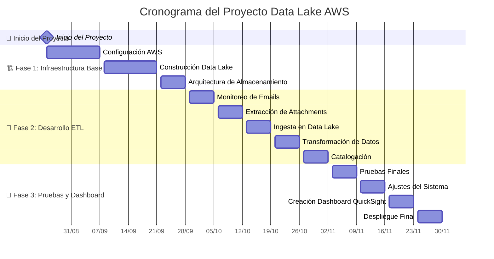
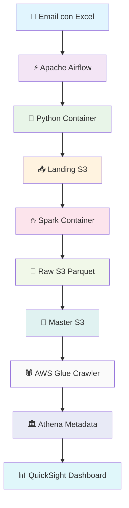
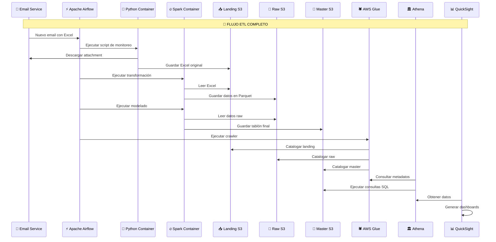

# Cronograma del Proyecto Data Lake AWS

## Diagrama de Gantt del Proyecto

## 🔄 Flujo de Datos ETL

## 📅 Cronograma Detallado por Semanas

### **Semana 1-2 (25 Ago - 7 Sep 2025)**
- **Configuración AWS**: Configuración de cuentas, IAM, VPC, y servicios base

### **Semana 3-4 (8 Sep - 21 Sep 2025)**
- **Construcción Data Lake**: Implementación de buckets S3 (Landing, Raw, Master)

### **Semana 5-6 (22 Sep - 28 Sep 2025)**
- **Arquitectura de Almacenamiento**: Definición de estructura de datos y políticas de retención

### **Semana 7-8 (29 Sep - 5 Oct 2025)**
- **Monitoreo de Emails**: Implementación del servicio de monitoreo de correos electrónicos

### **Semana 9-10 (6 Oct - 12 Oct 2025)**
- **Extracción de Attachments**: Desarrollo del proceso de descarga de archivos Excel

### **Semana 11-12 (13 Oct - 19 Oct 2025)**
- **Ingesta en Data Lake**: Implementación del proceso de carga inicial en S3 Landing

### **Semana 13-14 (20 Oct - 26 Oct 2025)**
- **Transformación de Datos**: Desarrollo del pipeline Spark para conversión a formato Parquet

### **Semana 15-16 (27 Oct - 2 Nov 2025)**
- **Catalogación**: Implementación del crawler de AWS Glue para metadatos

### **Semana 17-18 (3 Nov - 9 Nov 2025)**
- **Pruebas Finales**: Validación completa del flujo ETL

### **Semana 19-20 (10 Nov - 16 Nov 2025)**
- **Ajustes del Sistema**: Optimizaciones y correcciones basadas en pruebas

### **Semana 21-22 (17 Nov - 23 Nov 2025)**
- **Creación Dashboard QuickSight**: Desarrollo de visualizaciones y reportes

### **Semana 23-24 (24 Nov - 30 Nov 2025)**
- **Despliegue Final**: Puesta en producción del sistema completo

## Flujo de Datos ETL (Diagrama de Secuencia)

## 🎯 Hitos del Proyecto

| Hito | Fecha Objetivo | Descripción |
|------|----------------|-------------|
| 🏆 **Hito 1** | 28 Sep 2025 | Infraestructura AWS completamente configurada |
| 🚀 **Hito 2** | 2 Nov 2025 | Pipeline ETL funcionando y procesando datos |
| 🎉 **Hito 3** | 30 Nov 2025 | Sistema completo en producción con dashboard activo |

## 👥 Recursos y Responsabilidades

- **👨‍💻 DevOps Engineer**: Configuración AWS, infraestructura
- **🔧 Data Engineer**: Desarrollo ETL, pipeline de datos
- **📊 Data Analyst**: Creación de dashboard, validación de datos
- **📋 Project Manager**: Coordinación general, seguimiento de cronograma

## 📅 Resumen de Cronograma

- **🚀 Fecha de Inicio**: Lunes 25 de Agosto de 2025
- **🏁 Fecha de Finalización**: Domingo 30 de Noviembre de 2025
- **⏱️ Duración Total**: 14 semanas (3.5 meses)
- **📋 Fases**: 3 fases principales con hitos claros cada 4-6 semanas

## 🎨 Características del Cronograma

- **🔄 Sin Solapamientos**: Cada tarea tiene su tiempo exclusivo
- **📈 Dependencias Claras**: Las fases se ejecutan secuencialmente
- **🎯 Milestones**: Hitos claros para seguimiento del progreso
- **⚡ Agilidad**: Metodología ágil con entregas incrementales

## 📊 Cronograma Semanal Detallado

| Semana | Fechas | Actividades Principales | Entregables |
|--------|--------|------------------------|-------------|
| **1-2** | 25 Ago-7 Sep | Configuración AWS inicial | Cuentas y servicios base configurados |
| **3-4** | 8-21 Sep | Construcción Data Lake | Buckets S3 creados y configurados |
| **5-6** | 22-28 Sep | Arquitectura de almacenamiento | Estructura de datos definida |
| **7-8** | 29 Sep-5 Oct | Monitoreo de emails | Servicio de monitoreo funcionando |
| **9-10** | 6-12 Oct | Extracción de attachments | Proceso de descarga implementado |
| **11-12** | 13-19 Oct | Ingesta en Data Lake | Proceso de carga funcionando |
| **13-14** | 20-26 Oct | Transformación de datos | Pipeline Spark implementado |
| **15-16** | 27 Oct-2 Nov | Catalogación | Crawler Glue funcionando |
| **17-18** | 3-9 Nov | Pruebas finales | Sistema validado |
| **19-20** | 10-16 Nov | Ajustes del sistema | Sistema optimizado |
| **21-22** | 17-23 Nov | Dashboard QuickSight | Visualizaciones creadas |
| **23-24** | 24-30 Nov | Despliegue final | Sistema en producción |

## 🔍 Nota Importante sobre el Gantt

El diagrama de Gantt ahora está reorganizado para evitar solapamientos y mostrar claramente la fecha de inicio del 25 de agosto de 2025. Cada tarea tiene su tiempo exclusivo, lo que permite una mejor visualización y planificación del proyecto.

**Fechas clave del proyecto:**
- **🚀 INICIO**: 25 de Agosto de 2025
- **🏁 FIN**: 30 de Noviembre de 2025
- **⏱️ DURACIÓN**: 14 semanas (3.5 meses)