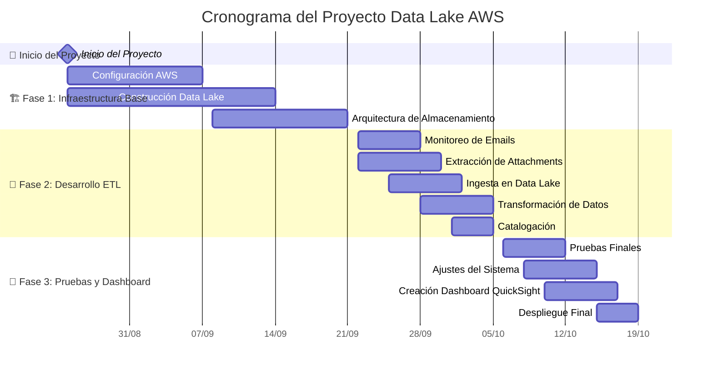
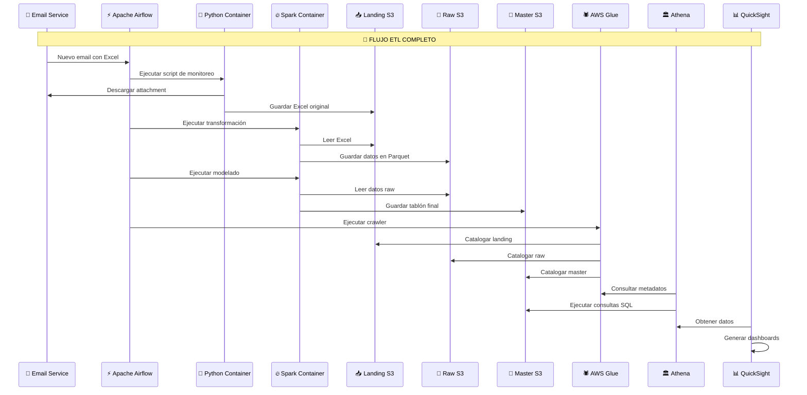

# Cronograma del Proyecto Data Lake AWS

## Diagrama de Gantt del Proyecto

## 📅 Cronograma Detallado por Semanas

### **Semana 1-2 (25 Ago - 7 Sep 2025)**
- **Configuración AWS**: Configuración de cuentas, IAM, VPC, y servicios base
- **Construcción Data Lake**: Implementación de buckets S3 (Landing, Raw, Master)

### **Semana 3-4 (8 Sep - 21 Sep 2025)**
- **Arquitectura de Almacenamiento**: Definición de estructura de datos y políticas de retención
- **Finalización Fase 1**: Infraestructura completamente configurada

### **Semana 5-6 (22 Sep - 5 Oct 2025)**
- **Monitoreo de Emails**: Implementación del servicio de monitoreo de correos electrónicos
- **Extracción de Attachments**: Desarrollo del proceso de descarga de archivos Excel
- **Ingesta en Data Lake**: Implementación del proceso de carga inicial en S3 Landing
- **Transformación de Datos**: Desarrollo del pipeline Spark para conversión a formato Parquet
- **Catalogación**: Implementación del crawler de AWS Glue para metadatos

### **Semana 7-8 (6 Oct - 19 Oct 2025)**
- **Pruebas Finales**: Validación completa del flujo ETL
- **Ajustes del Sistema**: Optimizaciones y correcciones basadas en pruebas
- **Creación Dashboard QuickSight**: Desarrollo de visualizaciones y reportes
- **Despliegue Final**: Puesta en producción del sistema completo

## Flujo de Datos ETL

## 🎯 Hitos del Proyecto

| Hito | Fecha Objetivo | Descripción |
|------|----------------|-------------|
| 🏆 **Hito 1** | 21 Sep 2025 | Infraestructura AWS completamente configurada |
| 🚀 **Hito 2** | 5 Oct 2025 | Pipeline ETL funcionando y procesando datos |
| 🎉 **Hito 3** | 19 Oct 2025 | Sistema completo en producción con dashboard activo |

## 👥 Recursos y Responsabilidades

- **👨‍💻 DevOps Engineer**: Configuración AWS, infraestructura
- **🔧 Data Engineer**: Desarrollo ETL, pipeline de datos
- **📊 Data Analyst**: Creación de dashboard, validación de datos
- **📋 Project Manager**: Coordinación general, seguimiento de cronograma

## 📅 Resumen de Cronograma

- **🚀 Fecha de Inicio**: Lunes 25 de Agosto de 2025
- **🏁 Fecha de Finalización**: Domingo 19 de Octubre de 2025
- **⏱️ Duración Total**: 8 semanas (2 meses)
- **📋 Fases**: 3 fases principales con hitos claros cada 2-4 semanas

## 🎨 Características del Cronograma

- **🔄 Paralelización**: Algunas tareas se ejecutan en paralelo para optimizar tiempo
- **📈 Dependencias**: Las fases tienen dependencias lógicas entre sí
- **🎯 Milestones**: Hitos claros para seguimiento del progreso
- **⚡ Agilidad**: Metodología ágil con entregas incrementales

## 📊 Cronograma Semanal Detallado

| Semana | Fechas | Actividades Principales | Entregables |
|--------|--------|------------------------|-------------|
| **1** | 25-31 Ago | Configuración AWS inicial | Cuentas y servicios base configurados |
| **2** | 1-7 Sep | Construcción Data Lake | Buckets S3 creados y configurados |
| **3** | 8-14 Sep | Arquitectura de almacenamiento | Estructura de datos definida |
| **4** | 15-21 Sep | Finalización infraestructura | Infraestructura lista para ETL |
| **5** | 22-28 Sep | Desarrollo ETL inicial | Monitoreo de emails funcionando |
| **6** | 29 Sep-5 Oct | Finalización ETL | Pipeline completo funcionando |
| **7** | 6-12 Oct | Pruebas y ajustes | Sistema validado y optimizado |
| **8** | 13-19 Oct | Dashboard y despliegue | Sistema en producción |

## 🔍 Nota Importante sobre el Gantt

El diagrama de Gantt de Mermaid puede cortar automáticamente el eje temporal para optimizar la visualización. Para asegurar que se vea la fecha de inicio completa (25 de Agosto 2025), se ha agregado un **milestone de inicio** que fuerza a Mermaid a mostrar desde esa fecha.

**Fechas clave del proyecto:**
- **🚀 INICIO**: 25 de Agosto de 2025
- **🏁 FIN**: 19 de Octubre de 2025
- **⏱️ DURACIÓN**: 8 semanas exactas