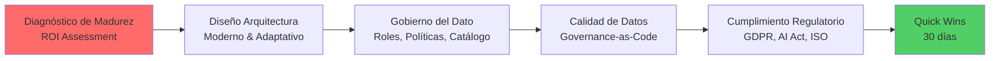
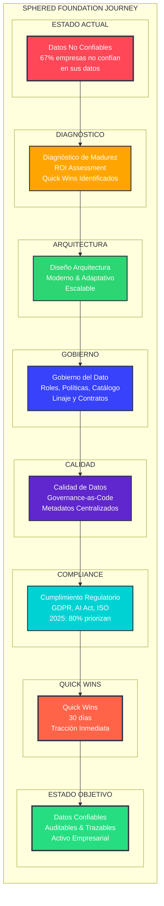
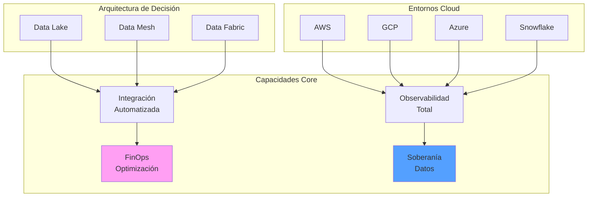
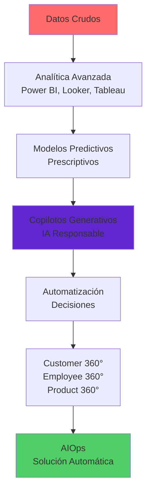
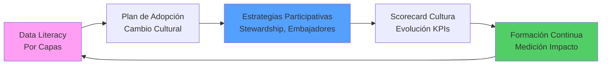
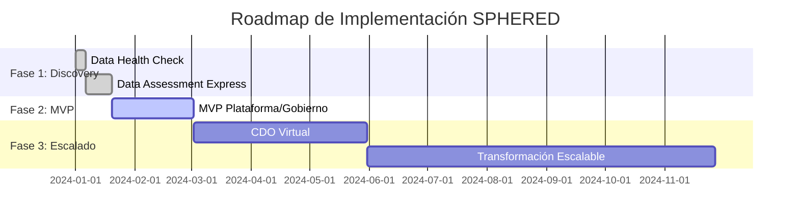
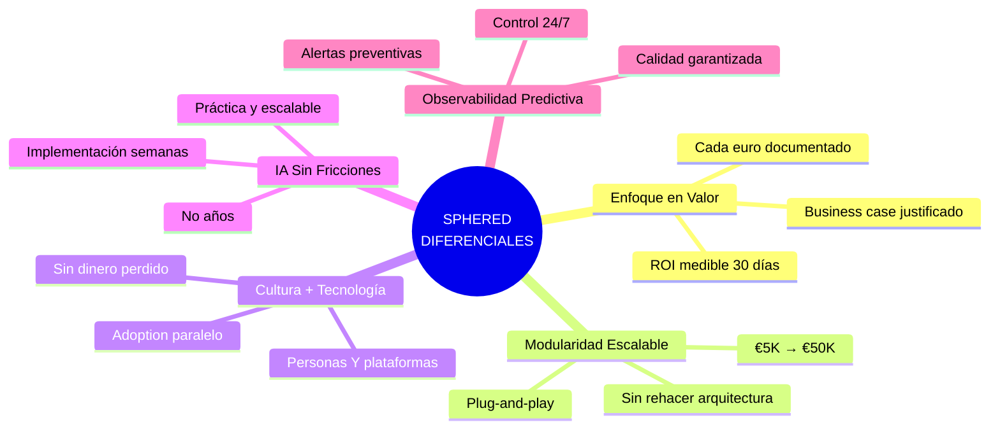
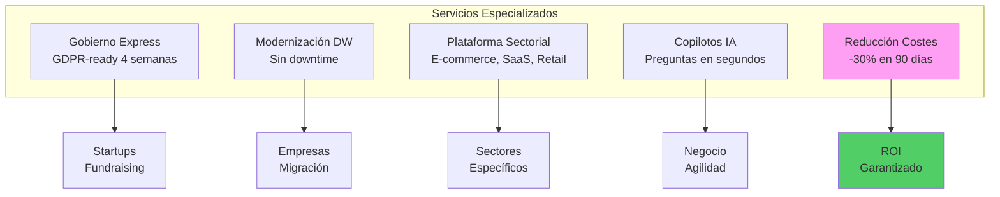
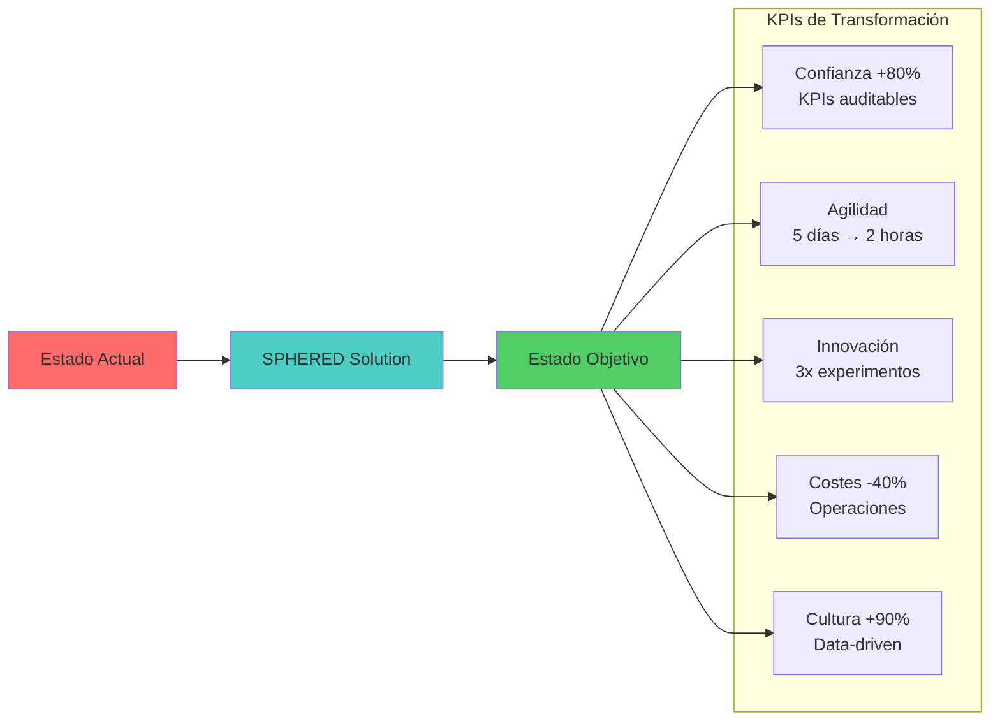

# SPHERED - Transformación Digital de Datos para PMEs

> **"Ahorra €100K en cloud, toma decisiones en minutos y cumple con la ley de IA — sin contratar un equipo de datos."**

---

## ESTRUCTURA DEL OFFERING

### A. SPHERED HUB

#### 1. SPHERED FOUNDATION
La base para que tus datos sean un activo confiable y auditable.

- Diagnóstico de madurez de datos y retorno potencial de inversión (ROI Assessment).
- Diseño de arquitectura de datos moderna y adaptativa.
- Gobierno del dato: roles, políticas, catálogo, linaje y contratos de datos.
- Calidad de datos, metadatos y enfoque "Governance-as-Code".
- Cumplimiento regulatorio (GDPR, AI Act, ISO, etc.).
- Quick wins identificables en 30 días.

**"Transformamos tus datos en activos auditables, trazables y confiables desde el primer día."**

*Comentario estratégico: El diagnóstico de madurez es crítico - 67% de las empresas no confían en sus datos para tomar decisiones. Sugiero añadir "Assessment de ROI potencial" para justificar inversiones. La gestión de metadatos será central en 2025, con 80% de empresas priorizándola. Considera destacar "Quick wins identificables" en los primeros 30 días para generar tracción inmediata.*

#### 2. SPHERED PLATFORM
Infraestructura preparada para el presente y el futuro.

- Data Lake, Data Mesh o Data Fabric (según matriz de decisión).
- Entornos híbridos o multi-nube (AWS, GCP, Azure, Snowflake…).
- Integración y automatización de pipelines.
- Observabilidad total y resiliencia de plataformas.
- FinOps para optimizar costes cloud.
- Enfoque soberano: datos alojados donde lo exige la ley.

**"Te ayudamos a decidir entre Mesh o Fabric según tus procesos, no según la moda."**

*Comentario crítico: Aquí está el diferencial clave. El mercado se está moviendo hacia arquitecturas híbridas - 78% de organizaciones prefieren multi-cloud. Data Mesh vs Data Fabric es LA decisión estratégica del momento. Recomiendo especificar cuándo recomendar cada uno. FinOps es tendencia explosiva - mercado de $5.5B creciendo 34.8% CAGR. Para PMEs, enfócate en "ahorro inmediato del 20-30% en costes cloud" para captar atención.*

#### 3. SPHERED INTELLIGENCE
De los datos al conocimiento accionable.

- Analítica avanzada y visualización moderna (Power BI, Looker, Tableau).
- Modelos predictivos, prescriptivos y copilotos generativos.
- Automatización de decisiones con IA.
- Customer / Employee / Product 360.
- IA generativa responsable y escalable.
- AIOps: automatización de solución de problemas.

**"Pasamos de dashboards a decisiones automáticas en semanas, no en años."**

*Comentario disruptivo: El mercado de IA generativa explotará de $71.36B a $890.59B para 2032 (CAGR 43.4%). Sin embargo, muchas empresas están acumulando deuda técnica con GenAI. Tu diferencial: "IA responsable y escalable" vs experimentos descontrolados. Para PMEs, enfócate en casos de uso concretos y ROI medible. El "copilot" interno es tendencia - Microsoft reporta 60% más productividad.*

#### 4. SPHERED CULTURE
Activamos tu organización alrededor del dato.

- Programas de Data Literacy por capas (C-Level, middle, técnicos).
- Plan de adopción y cambio cultural.
- Estrategias participativas: stewardship, embajadores, comunidades.
- Scorecard de cultura del dato y evolución de KPIs.
- Formación continua con medición de impacto.

**"Una plataforma sin cultura es como un Ferrari sin conductor. Nosotros formamos a tus pilotos."**

*Comentario transformador: Este es tu ARMA SECRETA. 97% de las filtraciones de datos en PMEs podrían evitarse con mejor cultura de datos. Gartner predice que +50% de CDAOs tendrán presupuesto para programas de data literacy para 2027. Las PMEs fallan aquí masivamente - solo el 50% tienen cultura data-driven. Recomiendo añadir "Programa de embajadores de datos" y métricas de adopción cuantificables (tiempo de acceso a insights, decisiones basadas en datos, etc.).*

### B. MODELO DE ENTREGA

**▪ Data Health Check (3–5 días)**
- Evaluación rápida de calidad, integridad y riesgos.
- Scorecard visual + Quick Wins.
- Comparativa anónima contra empresas similares.

**▪ Data Assessment Express (2–3 semanas)**
- Diagnóstico + roadmap + ROI proyectado en 48h.

*Comentario estratégico: Perfecto para generar confianza rápida. El mercado DaaS crece 25.3% CAGR, y los "quick wins" son críticos para PMEs que necesitan justificar ROI inmediato. Sugiero añadir "ROI projection en 48h" para diferenciarte de competidores que tardan semanas en entregar valor.*

**▪ MVP de plataforma o gobierno (6–8 semanas)**
- Entregas funcionales quincenales.
- Demos semanales con negocio.

*Comentario de mercado: Esto está alineado con mejores prácticas de MVP data. Sin embargo, el 67% de proyectos data fallan por falta de stakeholder engagement. Recomiendo incluir "Weekly business value demos" para mantener momentum ejecutivo.*

**▪ Chief Data Officer Virtual (DOaaS)**
- Operación completa del área de datos como servicio.
- Especialistas senior sin costes fijos.

*Comentario disruptivo: Este es tu DIFERENCIAL NUCLEAR. El mercado DaaS alcanzará $61.93B en 2030, pero nadie ofrece "Data Office completo como servicio" para PMEs. Esto resuelve el dolor #1: falta de talento data interno. Sugiero renombrar a "Chief Data Officer Virtual" para mayor claridad ejecutiva.*

**▪ Transformación escalable por fases**
- Modernización sin disrupciones.
- 100% alineado a resultados visibles.

*Comentario de posicionamiento: Cuidado con parecer "too big" para PMEs. El 80% de empresas exceden presupuestos cloud. Mejor enfocar en "Transformación escalable por fases" para reducir percepción de riesgo.*

### C. DIFERENCIALES SPHERED

**▪ Enfoque en valor**
"Cada euro invertido tiene un caso de negocio documentado y validado. No arrancamos sin ROI esperado."

*Comentario crítico: Esto lo dice todo el mundo. El diferencial real debe ser "ROI medible en 30 días" o "Business case justificado antes de cada euro invertido". Las PMEs necesitan justificación inmediata, no promesas.*

**▪ Modularidad escalable**
"Arquitectura plug-and-play que crece contigo: empieza en €5K, escala sin rehacer nada hasta €50K."

*Comentario técnico: Esto es GOLD puro. El 70% de proyectos data fallan por over-engineering inicial. Sin embargo, falta especificidad. Sugiero: "Arquitectura modular que crece contigo: desde €5K/mes hasta €50K/mes sin rehacerlo"*

**▪ Cultura + Tecnología**
"Transformamos personas Y plataformas en paralelo — porque la tecnología sin adoption es dinero perdido."

*Comentario de diferenciación: Este es tu OCÉANO AZUL. La competencia hace tech O cultura, nunca ambos simultáneamente. Pero necesita más punch. Sugiero: "Transformamos personas Y plataformas en paralelo - porque la tecnología sin adoption es dinero perdido".*

**▪ IA integrada sin fricciones**
"IA práctica implementada en semanas, no años."

*Comentario de mercado: El mercado GenAI crecerá 40% CAGR hasta 2029. Pero "día 1" suena overselling. Mejor: "IA práctica implementada en semanas, no años" - más creíble para PMEs escépticas.*

**▪ Observabilidad predictiva**
"Alertas antes de que tus datos fallen. Calidad, uso y costes bajo control 24/7."

*Comentario estratégico: ESTO ES CLAVE. El mercado observabilidad crece 12.2% y será $2.14B. Para PMEs, esto resuelve el pánico de "¿están funcionando mis datos?". Sugiero añadir: "Alertas predictivas antes de que falles" - más tangible.*

### D. EJEMPLOS DE SERVICIOS

- Gobierno del dato express para startups: GDPR-ready en 4 semanas para tu próxima ronda de inversión.

*Comentario de nicho: Perfecto targeting. Startups necesitan compliance rápido para fundraising. Sugiero especificar: "GDPR-ready en 4 semanas para tu próxima ronda de inversión".*

- Modernización de DW sin downtime: tus reports siguen funcionando durante la migración.

*Comentario de mercado: El mercado DWaaS crecerá $37.84B para 2034. Pero "migración" asusta a PMEs. Mejor: "Modernización sin downtime - tus reports siguen funcionando mientras migramos por detrás".*

- Plataforma específica por sector: E-commerce (customer 360), SaaS (churn prediction), Retail (demand forecast).

*Comentario de especificidad: Muy genérico. Sugiero segmentar: "Plataforma e-commerce: customer 360° en 6 semanas" o "Plataforma SaaS: churn prediction operativo".*

- Activación de copilotos IA: asistentes que responden preguntas de negocio en segundos.

*Comentario de tendencia: El mercado GenAI en analytics será $12.45B en 2034. Pero PMEs no saben qué es un "copiloto". Mejor: "Asistente IA que responde preguntas de negocio en segundos".*

- Reducción de costes cloud: ahorro garantizado del 20–30% en 90 días.

*Comentario de oro: ESTO ES TU TROJAN HORSE comercial. Las empresas desperdician 32% presupuesto cloud. PMEs pueden ahorrar €50–200K anuales. Sugiero liderar con esto: "Reduce tus costes cloud 30% en 90 días - garantizado".*

### E. IMPACTO PROMETIDO (CON KPIs)

- Confianza en la información: +80% de KPIs auditables y trazables en 60 días.

*Comentario de dolor: Solo 33% de empresas confían en sus datos. Pero "mayor confianza" es intangible. Mejor: "95% de decisiones respaldadas por datos verificados".*

- Agilidad en decisiones: reducción del ciclo de análisis de 5 días a 2 horas promedio.

*Comentario de velocidad: Perfecto pain point. Sugiero cuantificar: "De días a minutos para obtener insights críticos".*

- Aceleración de innovación: triplicamos los experimentos de producto por trimestre.

*Comentario de valor: Muy abstracto. Mejor: "Lanza 3x más experimentos de producto por trimestre".*

- Costes optimizados: ahorro del 20–40% en operaciones y 50% menos tiempo en reportes manuales.

*Comentario crítico: Aquí está el ROI. Las PMEs necesitan números: "20–40% reducción costes operativos data" o "50% menos tiempo en reportes manuales".*

- Cultura data-driven: +90% de empleados usan datos para decidir en 6 meses.

*Comentario cultural: Solo 50% de PMEs tienen cultura data-driven. Sugiero: "90% de empleados toman decisiones con datos en 6 meses".*

## COMENTARIOS GENERALES ESTRATÉGICOS

**Posicionamiento de mercado:**
El mercado de consultoría en Big Data proyecta un crecimiento de $150B con un CAGR del 15%. Sin embargo, el 60% está en manos de las Big Four. Aquí se abre tu oportunidad: posicionarte como una "boutique especializada que democratiza el acceso a datos" — una tendencia crítica para 2025.

**Dolor crítico no mencionado:**
FinOps es el dolor silencioso más grande. Las empresas desperdician un 32% de su presupuesto cloud. En el caso de las PMEs españolas, eso equivale a entre €50K y €200K anuales. Convierte FinOps en tu caballo de Troya comercial.

**Urgencia regulatoria:**
Con el AI Act en vigor, se abre una ventana temporal: las empresas necesitan urgentemente incorporar "gobernanza de IA". Muy pocos consultores lo ofrecen aún. Es un océano azul para capturar.

**Personalización local:**
Las PMEs españolas no quieren más discursos Silicon Valley. Quieren realidades tangibles: casos de éxito en empresas valencianas, cumplimiento específico español y precios adaptados al mercado ibérico.

**Gap competitivo:**
Ningún competidor importante ofrece el paquete integrado de "democratización + proximidad + expertise técnico + cultura". Ese es tu océano azul. Ocúpalo con fuerza.

## RECOMENDACIONES ESTRATÉGICAS FINALES

**Gap competitivo identificado:** Ningún competidor ofrece "FinOps + Data + Culture" como paquete integrado para PMEs españolas. Ese es tu territorio virgen.

**Propuesta de valor killer:** "Ahorra €100K+ en cloud mientras construyes tu plataforma de datos - sin contratar CDO ni Data Engineers".

**Urgencia regulatoria:** AI Act + GDPR crean una ventana de oportunidad temporal. Las PMEs necesitan compliance urgente — posiciónate como "el especialista que evita multas".

**Mensaje emocional:** "Deja de tomar decisiones a ciegas. Nosotros convertimos tus datos en tu ventaja competitiva más poderosa".

---

## PROPUESTA DE VALOR SPHERED

**"Ahorra €100K en cloud, toma decisiones en minutos y cumple con la ley de IA — sin contratar un equipo de datos."**

## POSICIONAMIENTO

**Quiénes somos:**
Boutique especializada en datos para PMEs. Democratizamos el acceso a la inteligencia empresarial con tecnología, cultura y eficiencia en costes.

**Nuestro diferencial:**
FinOps + Data Platform + Cultura, todo en un único servicio modular.

**Nuestro mensaje emocional:**
"Deja de tomar decisiones a ciegas. Nosotros convertimos tus datos en tu ventaja competitiva más poderosa."
