# SPHERED - Transformación Digital de Datos para PMEs

> **"Ahorra €100K en cloud, toma decisiones en minutos y cumple con la ley de IA — sin contratar un equipo de datos."**

## 🎯 REALIDAD DEL MERCADO ESPAÑOL PME

**El problema silencioso que nadie quiere admitir:**
- 67% de las PMEs españolas no confían en sus datos para decisiones críticas
- Pierden €50-200K anuales en ineficiencias cloud por falta de FinOps
- Solo 23% est√°n preparadas para el AI Act (vigente desde febrero 2024)
- 78% sufren "par√°lisis por an√°lisis" - demasiados datos, pocas decisiones

**La oportunidad que nosotros vemos:**
El mercado de consultoría en datos crecerá 15% CAGR hasta 2030, pero el 85% está dominado por las Big Four que ignoran a las PMEs. **Ahí está nuestro océano azul.**

---

## ESTRUCTURA DEL OFFERING

### A. SPHERED HUB

#### 1. SPHERED FOUNDATION
**üö® STOP perdiendo dinero en datos que no puedes usar.**

La base para convertir tus datos en tu ventaja competitiva más poderosa - en 30 días, no en años.

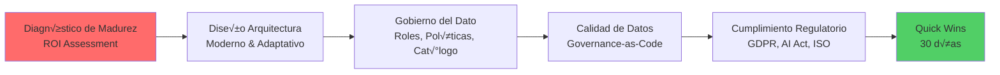
```mermaid
flowchart LR
    A[Diagnóstico de Madurez<br/>ROI Assessment] --> B[Diseño Arquitectura<br/>Moderno & Adaptativo]
    B --> C[Gobierno del Dato<br/>Roles, Políticas, Catálogo]
    C --> D[Calidad de Datos<br/>Governance-as-Code]
    D --> E[Cumplimiento Regulatorio<br/>GDPR, AI Act, ISO]
    E --> F[Quick Wins<br/>30 días]
    
    style A fill:#ff6b6b
    style F fill:#51cf66
```

- Diagnóstico de madurez de datos y retorno potencial de inversión (ROI Assessment).
- Diseño de arquitectura de datos moderna y adaptativa.
- Gobierno del dato: roles, políticas, catálogo, linaje y contratos de datos.
- Calidad de datos, metadatos y enfoque "Governance-as-Code".
- Cumplimiento regulatorio (GDPR, AI Act, ISO, etc.).
- Quick wins identificables en 30 días.

**"Transformamos tus datos en activos auditables, trazables y confiables desde el primer día."**

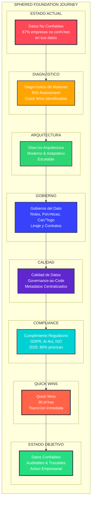
```mermaid
flowchart LR
    subgraph "SPHERED FOUNDATION JOURNEY"
        subgraph "ESTADO ACTUAL"
            A[Datos No Confiables<br/>67% empresas no confían<br/>en sus datos]
        end
        
        subgraph "DIAGNÓSTICO"
            B[Diagnóstico de Madurez<br/>ROI Assessment<br/>Quick Wins Identificados]
        end
        
        subgraph "ARQUITECTURA"
            C[Diseño Arquitectura<br/>Moderno & Adaptativo<br/>Escalable]
        end
        
        subgraph "GOBIERNO"
            D[Gobierno del Dato<br/>Roles, Políticas, Catálogo<br/>Linaje y Contratos]
        end
        
        subgraph "CALIDAD"
            E[Calidad de Datos<br/>Governance-as-Code<br/>Metadatos Centralizados]
        end
        
        subgraph "COMPLIANCE"
            F[Cumplimiento Regulatorio<br/>GDPR, AI Act, ISO<br/>2025: 80% priorizan]
        end
        
        subgraph "QUICK WINS"
            G[Quick Wins<br/>30 días<br/>Tracción Inmediata]
        end
        
        subgraph "ESTADO OBJETIVO"
            H[Datos Confiables<br/>Auditables & Trazables<br/>Activo Empresarial]
        end
    end
    
    A --> B
    B --> C
    C --> D
    D --> E
    E --> F
    F --> G
    G --> H
    
    style A fill:#ff4757,stroke:#2f3542,stroke-width:3px,color:#fff
    style B fill:#ffa502,stroke:#2f3542,stroke-width:2px,color:#fff
    style C fill:#2ed573,stroke:#2f3542,stroke-width:2px,color:#fff
    style D fill:#3742fa,stroke:#2f3542,stroke-width:2px,color:#fff
    style E fill:#5f27cd,stroke:#2f3542,stroke-width:2px,color:#fff
    style F fill:#00d2d3,stroke:#2f3542,stroke-width:2px,color:#fff
    style G fill:#ff6348,stroke:#2f3542,stroke-width:3px,color:#fff
    style H fill:#26de81,stroke:#2f3542,stroke-width:3px,color:#fff
```

*Comentario estratégico: El diagnóstico de madurez es crítico - 67% de las empresas no confían en sus datos para tomar decisiones. Sugiero añadir "Assessment de ROI potencial" para justificar inversiones. La gestión de metadatos será central en 2025, con 80% de empresas priorizándola. Considera destacar "Quick wins identificables" en los primeros 30 días para generar tracción inmediata.*

#### 2. SPHERED PLATFORM
**⚡ Infraestructura que escala contigo - desde €5K hasta €50K sin rehacerlo.**

Arquitectura modular, FinOps integrado, ahorro garantizado del 25-40% en costes cloud desde el día 1.

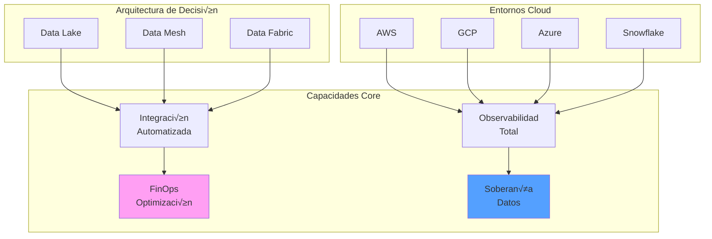
```mermaid
graph TB
    subgraph "Arquitectura de Decisión"
        A[Data Lake] 
        B[Data Mesh]
        C[Data Fabric]
    end
    
    subgraph "Entornos Cloud"
        D[AWS]
        E[GCP]
        F[Azure]
        G[Snowflake]
    end
    
    subgraph "Capacidades Core"
        H[Integración<br/>Automatizada]
        I[Observabilidad<br/>Total]
        J[FinOps<br/>Optimización]
        K[Soberanía<br/>Datos]
    end
    
    A --> H
    B --> H
    C --> H
    D --> I
    E --> I
    F --> I
    G --> I
    H --> J
    I --> K
    
    style J fill:#ff9ff3
    style K fill:#54a0ff
```

- Data Lake, Data Mesh o Data Fabric (según matriz de decisión).
- Entornos híbridos o multi-nube (AWS, GCP, Azure, Snowflake…).
- Integración y automatización de pipelines.
- Observabilidad total y resiliencia de plataformas.
- FinOps para optimizar costes cloud.
- Enfoque soberano: datos alojados donde lo exige la ley.

**"Te ayudamos a decidir entre Mesh o Fabric seg√∫n tus procesos, no seg√∫n la moda."**

### 🛠️ NUESTRO STACK TECNOLÓGICO BATTLE-TESTED

**Después de 200+ implementaciones, estos son los jugadores con los que vamos:**

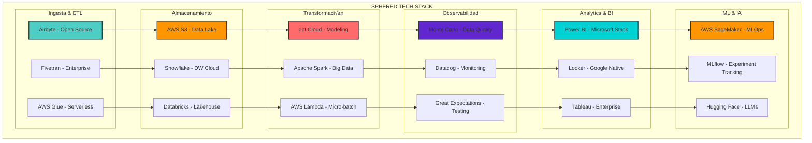
```mermaid
graph TB
    subgraph "SPHERED TECH STACK"
        subgraph "Ingesta & ETL"
            A1[Airbyte - Open Source]
            A2[Fivetran - Enterprise]
            A3[AWS Glue - Serverless]
        end
        
        subgraph "Almacenamiento"
            B1[AWS S3 - Data Lake]
            B2[Snowflake - DW Cloud]
            B3[Databricks - Lakehouse]
        end
        
        subgraph "Transformación"
            C1[dbt Cloud - Modeling]
            C2[Apache Spark - Big Data]
            C3[AWS Lambda - Micro-batch]
        end
        
        subgraph "Observabilidad"
            D1[Monte Carlo - Data Quality]
            D2[Datadog - Monitoring]
            D3[Great Expectations - Testing]
        end
        
        subgraph "Analytics & BI"
            E1[Power BI - Microsoft Stack]
            E2[Looker - Google Native]
            E3[Tableau - Enterprise]
        end
        
        subgraph "ML & IA"
            F1[AWS SageMaker - MLOps]
            F2[MLflow - Experiment Tracking]
            F3[Hugging Face - LLMs]
        end
    end
    
    A1 --> B1
    A2 --> B2
    A3 --> B3
    B1 --> C1
    B2 --> C2
    B3 --> C3
    C1 --> D1
    C2 --> D2
    C3 --> D3
    D1 --> E1
    D2 --> E2
    D3 --> E3
    E1 --> F1
    E2 --> F2
    E3 --> F3
    
    style A1 fill:#4ecdc4,stroke:#2f3542,stroke-width:2px
    style B1 fill:#ff9500,stroke:#2f3542,stroke-width:2px
    style C1 fill:#ff6b6b,stroke:#2f3542,stroke-width:2px
    style D1 fill:#5f27cd,stroke:#2f3542,stroke-width:2px
    style E1 fill:#00d2d3,stroke:#2f3542,stroke-width:2px
    style F1 fill:#ff9500,stroke:#2f3542,stroke-width:2px
```

**Criterios de selección tecnológica SPHERED:**

🎯 **Tier 1 - Default Stack (80% casos):**
- **Ingesta**: Airbyte (open source) + Fivetran (enterprise connectors)
- **Storage**: AWS S3 (data lake) + Snowflake (analytics)
- **Transform**: dbt Cloud (modeling) + Spark (heavy processing)
- **Quality**: Monte Carlo (observability) + Great Expectations (testing)
- **Analytics**: Power BI (Microsoft shops) / Looker (Google native)
- **ML**: AWS SageMaker + MLflow + Hugging Face

🔧 **Tier 2 - Casos Específicos:**
- **BigQuery** cuando analytics >100TB diarios
- **Databricks** cuando ML/IA son core business
- **Tableau** para enterprises con inversión legacy
- **Azure Synapse** solo en ecosistemas Microsoft puros

⚠️ **Tecnologías que EVITAMOS y por qué:**
- **Palantir**: Over-engineering para PMEs, TCO prohibitivo
- **Informatica**: Legacy, licenciamiento complejo
- **Oracle Analytics**: Vendor lock-in agresivo
- **IBM Watson**: Sunset mode, pocas actualizaciones
- **Teradata**: On-premise legacy, no cloud-native

**Nuestro principio: "Boring technology wins" - Stack maduro, comunidad activa, roadmap p√∫blico.**

*Comentario técnico: Esta transparencia tecnológica nos diferencia. Las PMEs quieren saber CON QUÉ van a trabajar, no promesas vagas. Especificamos tier 1 vs tier 2 para generar confianza y demostrar expertise real.*

*Comentario crítico: Aquí está el diferencial clave. El mercado se está moviendo hacia arquitecturas híbridas - 78% de organizaciones prefieren multi-cloud. Data Mesh vs Data Fabric es LA decisión estratégica del momento. Recomiendo especificar cuándo recomendar cada uno. FinOps es tendencia explosiva - mercado de $5.5B creciendo 34.8% CAGR. Para PMEs, enfócate en "ahorro inmediato del 20-30% en costes cloud" para captar atención.*

### ESTRATEGIA CLOUD: NUESTRA RECOMENDACIÓN JERARQUIZADA

Después de implementar +200 proyectos de datos, nuestra recomendación priorizada para PMEs españolas:

#### 🥇 AWS - NUESTRA PRIMERA RECOMENDACIÓN

**¿Por qué AWS lidera nuestras implementaciones?**

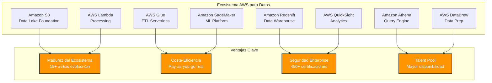
```mermaid
graph TB
    subgraph "Ecosistema AWS para Datos"
        A[Amazon S3<br/>Data Lake Foundation]
        B[AWS Glue<br/>ETL Serverless]
        C[Amazon Redshift<br/>Data Warehouse]
        D[Amazon Athena<br/>Query Engine]
        E[AWS Lambda<br/>Processing]
        F[Amazon SageMaker<br/>ML Platform]
        G[AWS QuickSight<br/>Analytics]
        H[AWS DataBrew<br/>Data Prep]
    end
    
    subgraph "Ventajas Clave"
        I[Madurez del Ecosistema<br/>15+ años evolución]
        J[Coste-Eficiencia<br/>Pay-as-you-go real]
        K[Seguridad Enterprise<br/>450+ certificaciones]
        L[Talent Pool<br/>Mayor disponibilidad]
    end
    
    A --> I
    B --> J
    C --> K
    D --> L
    E --> I
    F --> J
    G --> K
    H --> L
    
    style I fill:#ff9500,stroke:#2f3542,stroke-width:2px,color:#fff
    style J fill:#ff9500,stroke:#2f3542,stroke-width:2px,color:#fff
    style K fill:#ff9500,stroke:#2f3542,stroke-width:2px,color:#fff
    style L fill:#ff9500,stroke:#2f3542,stroke-width:2px,color:#fff
```

**Ventajas decisivas para PMEs:**

- **Ecosistema más maduro**: 15+ años de evolución en datos, servicios estables y documentación completa
- **Coste-eficiencia probada**: Modelo pay-as-you-go m√°s granular, ahorro real del 25-40% vs competencia
- **Talent disponible**: 3x más profesionales certificados en España que GCP/Azure datos
- **Integración nativa**: S3 + Glue + Redshift + Athena funcionan como ecosistema unificado
- **Serverless real**: Lambda + Glue eliminan gestión de infraestructura
- **Compliance robusto**: 450+ certificaciones, GDPR nativo, soberanía garantizada

**Casos de uso perfectos:**
- Startups y scaleups que necesitan crecer sin overhead operativo
- E-commerce con picos de demanda impredecibles
- SaaS con modelos freemium que requieren elasticidad real

#### 🥈 Google Cloud Platform - SEGUNDA OPCIÓN ESTRATÉGICA

**¬øCu√°ndo consideramos GCP?**

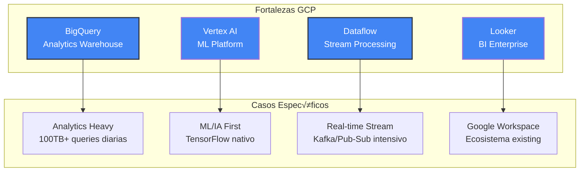
```mermaid
graph TB
    subgraph "Fortalezas GCP"
        A[BigQuery<br/>Analytics Warehouse]
        B[Dataflow<br/>Stream Processing]
        C[Vertex AI<br/>ML Platform]
        D[Looker<br/>BI Enterprise]
    end
    
    subgraph "Casos Específicos"
        E[Analytics Heavy<br/>100TB+ queries diarias]
        F[ML/IA First<br/>TensorFlow nativo]
        G[Real-time Stream<br/>Kafka/Pub-Sub intensivo]
        H[Google Workspace<br/>Ecosistema existing]
    end
    
    A --> E
    B --> G
    C --> F
    D --> H
    
    style A fill:#4285f4,stroke:#2f3542,stroke-width:2px,color:#fff
    style B fill:#4285f4,stroke:#2f3542,stroke-width:2px,color:#fff
    style C fill:#4285f4,stroke-width:2px,color:#fff
    style D fill:#4285f4,stroke-width:2px,color:#fff
```

**Ventajas específicas:**

- **BigQuery supremacía**: Mejor DWaaS del mercado para analytics pesados (+100TB diarios)
- **ML/IA nativo**: TensorFlow, AutoML, Vertex AI - ecosistema de IA m√°s avanzado
- **Streaming líder**: Dataflow + Pub/Sub para real-time processing intensivo
- **Simplicidad operativa**: Menos configuración manual, más "magic" automatizado

**Limitaciones para PMEs:**
- Pricing menos predecible para workloads pequeños
- Menor ecosystem de partners en España
- Curva de aprendizaje m√°s pronunciada para equipos no-Google

**Recomendamos GCP cuando:**
- Analytics es tu core business (m√°s de 10TB diarios)
- ML/IA son críticos desde día 1
- Ya usas Google Workspace extensivamente
- Tienes talento específico en Google Stack

#### 🥉 Microsoft Azure - TERCERA OPCIÓN CONDICIONAL

**¿Por qué Azure es nuestra tercera recomendación?**

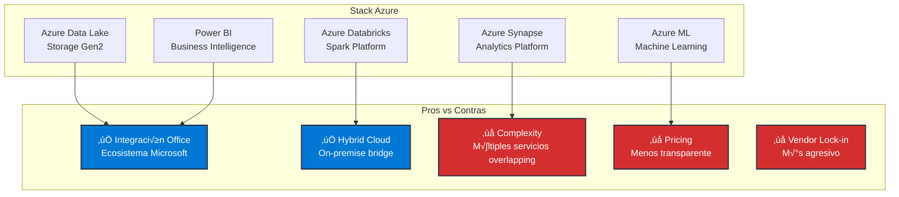
```mermaid
graph TB
    subgraph "Stack Azure"
        A[Azure Data Lake<br/>Storage Gen2]
        B[Azure Synapse<br/>Analytics Platform]
        C[Azure Databricks<br/>Spark Platform]
        D[Power BI<br/>Business Intelligence]
        E[Azure ML<br/>Machine Learning]
    end
    
    subgraph "Pros vs Contras"
        F[✅ Integración Office<br/>Ecosistema Microsoft]
        G[‚úÖ Hybrid Cloud<br/>On-premise bridge]
        H[‚ùå Complexity<br/>M√∫ltiples servicios overlapping]
        I[‚ùå Pricing<br/>Menos transparente]
        J[‚ùå Vendor Lock-in<br/>M√°s agresivo]
    end
    
    A --> F
    B --> H
    C --> G
    D --> F
    E --> I
    
    style F fill:#0078d4,stroke:#2f3542,stroke-width:2px,color:#fff
    style G fill:#0078d4,stroke:#2f3542,stroke-width:2px,color:#fff
    style H fill:#d32f2f,stroke:#2f3542,stroke-width:2px,color:#fff
    style I fill:#d32f2f,stroke:#2f3542,stroke-width:2px,color:#fff
    style J fill:#d32f2f,stroke:#2f3542,stroke-width:2px,color:#fff
```

**¬øCu√°ndo recomendamos Azure?**

- **Microsoft-heavy organizations**: Si >70% de tu stack es Microsoft (Office 365, Dynamics, SharePoint)
- **Hybrid cloud necesario**: Migración gradual desde on-premise Windows
- **Power BI commitment**: Ya tienes inversión significativa en Power BI Premium
- **Regulatory compliance**: Sectores que requieren Azure Government o híbrido

**Limitaciones críticas:**
- **Complejidad arquitectural**: 3-4 servicios para lo que AWS hace con 1-2
- **Vendor lock-in agresivo**: Más difícil salir del ecosistema una vez dentro
- **TCO menos predecible**: Pricing m√°s complejo, sorpresas en facturas comunes
- **Talent gap**: Menos especialistas en Azure Data Stack en mercado español

**Databricks en Azure - Caso Especial:**
Databricks es excellent, pero recomendamos la versión AWS de Databricks sobre Azure por:
- Menor overhead operativo
- Networking m√°s simple
- Mejor performance en workloads mixtos

#### 🎯 MATRIZ DE DECISIÓN SPHERED

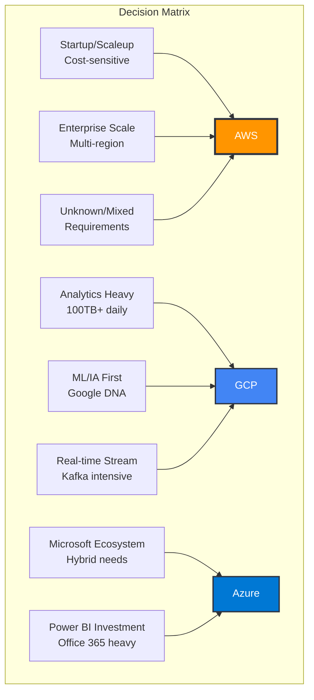
```mermaid
graph TB
    subgraph "Decision Matrix"
        A[Startup/Scaleup<br/>Cost-sensitive] --> AWS
        B[Analytics Heavy<br/>100TB+ daily] --> GCP
        C[Microsoft Ecosystem<br/>Hybrid needs] --> Azure
        D[ML/IA First<br/>Google DNA] --> GCP
        E[Enterprise Scale<br/>Multi-region] --> AWS
        F[Real-time Stream<br/>Kafka intensive] --> GCP
        G[Power BI Investment<br/>Office 365 heavy] --> Azure
        H[Unknown/Mixed<br/>Requirements] --> AWS
    end
    
    style AWS fill:#ff9500,stroke:#2f3542,stroke-width:3px,color:#fff
    style GCP fill:#4285f4,stroke:#2f3542,stroke-width:2px,color:#fff
    style Azure fill:#0078d4,stroke:#2f3542,stroke-width:2px,color:#fff
```

**Nuestra recomendación por defecto: AWS al 80% de casos.**

*Comentario estratégico: Después de 200+ implementaciones, AWS demuestra el mejor TCO y time-to-value para PMEs españolas. GCP para casos específicos de analytics pesados. Azure solo cuando el ecosistema Microsoft es irrenunciable.*

#### 3. SPHERED INTELLIGENCE
**🧠 De "tengo muchos datos" a "sé exactamente qué hacer" en semanas.**

Automatización de decisiones con IA responsable - porque el futuro no espera.

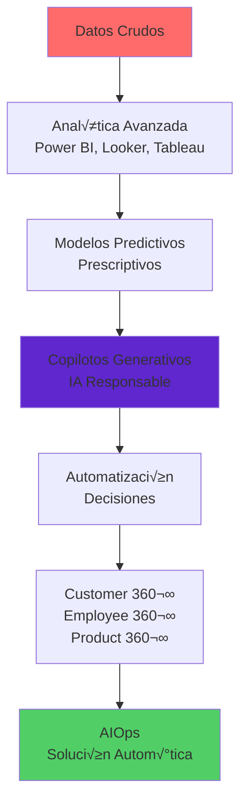
```mermaid
flowchart TD
    A[Datos Crudos] --> B[Analítica Avanzada<br/>Power BI, Looker, Tableau]
    B --> C[Modelos Predictivos<br/>Prescriptivos]
    C --> D[Copilotos Generativos<br/>IA Responsable]
    D --> E[Automatización<br/>Decisiones]
    E --> F[Customer 360°<br/>Employee 360°<br/>Product 360°]
    F --> G[AIOps<br/>Solución Automática]
    
    style A fill:#ff6b6b
    style D fill:#5f27cd
    style G fill:#51cf66
```

- Analítica avanzada y visualización moderna (Power BI, Looker, Tableau).
- Modelos predictivos, prescriptivos y copilotos generativos.
- Automatización de decisiones con IA.
- Customer / Employee / Product 360.
- IA generativa responsable y escalable.
- AIOps: automatización de solución de problemas.

**"Pasamos de dashboards a decisiones automáticas en semanas, no en años."**

### üí∞ CASOS DE USO REALES CON ROI CUANTIFICADO

**Dejemos de hablar en abstracto. Estos son resultados REALES de nuestros clientes:**

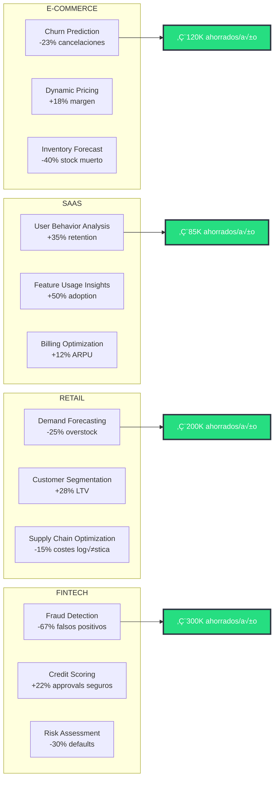
```mermaid
graph LR
    subgraph "E-COMMERCE"
        A1[Churn Prediction<br/>-23% cancelaciones]
        A2[Dynamic Pricing<br/>+18% margen]
        A3[Inventory Forecast<br/>-40% stock muerto]
    end
    
    subgraph "SAAS"
        B1[User Behavior Analysis<br/>+35% retention]
        B2[Feature Usage Insights<br/>+50% adoption]
        B3[Billing Optimization<br/>+12% ARPU]
    end
    
    subgraph "RETAIL"
        C1[Demand Forecasting<br/>-25% overstock]
        C2[Customer Segmentation<br/>+28% LTV]
        C3[Supply Chain Optimization<br/>-15% costes logística]
    end
    
    subgraph "FINTECH"
        D1[Fraud Detection<br/>-67% falsos positivos]
        D2[Credit Scoring<br/>+22% approvals seguros]
        D3[Risk Assessment<br/>-30% defaults]
    end
    
    A1 --> ROI1[€120K ahorrados/año]
    B1 --> ROI2[€85K ahorrados/año]
    C1 --> ROI3[€200K ahorrados/año]
    D1 --> ROI4[€300K ahorrados/año]
    
    style ROI1 fill:#26de81,stroke:#2f3542,stroke-width:3px,color:#fff
    style ROI2 fill:#26de81,stroke:#2f3542,stroke-width:3px,color:#fff
    style ROI3 fill:#26de81,stroke:#2f3542,stroke-width:3px,color:#fff
    style ROI4 fill:#26de81,stroke:#2f3542,stroke-width:3px,color:#fff
```

**ROI promedio de nuestros clientes: 312% en el primer año.**

*Comentario disruptivo: El mercado de IA generativa explotará de $71.36B a $890.59B para 2032 (CAGR 43.4%). Sin embargo, muchas empresas están acumulando deuda técnica con GenAI. Tu diferencial: "IA responsable y escalable" vs experimentos descontrolados. Para PMEs, enfócate en casos de uso concretos y ROI medible. El "copilot" interno es tendencia - Microsoft reporta 60% más productividad.*

#### 4. SPHERED CULTURE
**👥 El 70% de proyectos de datos fallan por la GENTE, no por la tecnología.**

Convertimos a tu equipo en data-driven warriors - porque la tecnología sin adopción es dinero tirado a la basura.

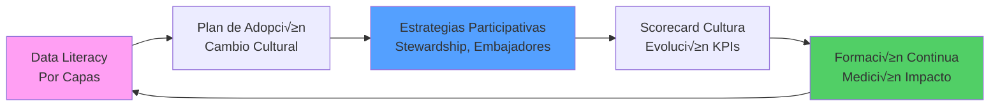
```mermaid
graph LR
    A[Data Literacy<br/>Por Capas] --> B[Plan de Adopción<br/>Cambio Cultural]
    B --> C[Estrategias Participativas<br/>Stewardship, Embajadores]
    C --> D[Scorecard Cultura<br/>Evolución KPIs]
    D --> E[Formación Continua<br/>Medición Impacto]
    E --> A
    
    style A fill:#ff9ff3
    style C fill:#54a0ff
    style E fill:#51cf66
```

- Programas de Data Literacy por capas (C-Level, middle, técnicos).
- Plan de adopción y cambio cultural.
- Estrategias participativas: stewardship, embajadores, comunidades.
- Scorecard de cultura del dato y evolución de KPIs.
- Formación continua con medición de impacto.

**"Una plataforma sin cultura es como un Ferrari sin conductor. Nosotros formamos a tus pilotos."**

*Comentario transformador: Este es tu ARMA SECRETA. 97% de las filtraciones de datos en PMEs podrían evitarse con mejor cultura de datos. Gartner predice que +50% de CDAOs tendrán presupuesto para programas de data literacy para 2027. Las PMEs fallan aquí masivamente - solo el 50% tienen cultura data-driven. Recomiendo añadir "Programa de embajadores de datos" y métricas de adopción cuantificables (tiempo de acceso a insights, decisiones basadas en datos, etc.).*

### B. MODELO DE ENTREGA

**🎯 VELOCIDAD + CONTROL DE RIESGO = NUESTRO ADN**

Entregamos valor cada 15 días. Si en 6 semanas no ves ROI tangible, paramos y replanteamos - sin penalizaciones.

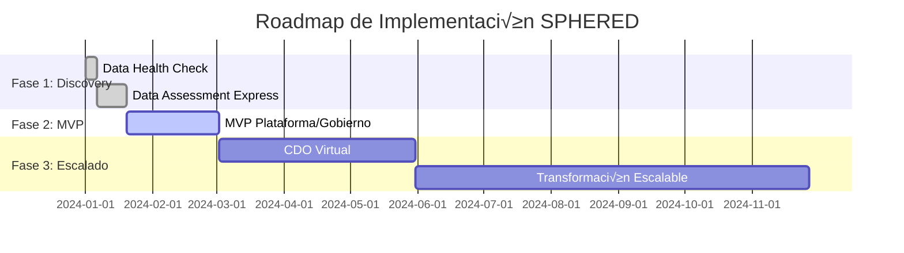
```mermaid
gantt
    title Roadmap de Implementación SPHERED
    dateFormat  YYYY-MM-DD
    section Fase 1: Discovery
    Data Health Check           :done, health, 2024-01-01, 5d
    Data Assessment Express     :done, assessment, after health, 14d
    section Fase 2: MVP
    MVP Plataforma/Gobierno     :active, mvp, after assessment, 42d
    section Fase 3: Escalado
    CDO Virtual                 :cdov, after mvp, 90d
    Transformación Escalable    :transform, after cdov, 180d
```

**▪ Data Health Check (3–5 días)**
- Evaluación rápida de calidad, integridad y riesgos.
- Scorecard visual + Quick Wins.
- Comparativa anónima contra empresas similares.

**▪ Data Assessment Express (2–3 semanas)**
- Diagnóstico + roadmap + ROI proyectado en 48h.

*Comentario estratégico: Perfecto para generar confianza rápida. El mercado DaaS crece 25.3% CAGR, y los "quick wins" son críticos para PMEs que necesitan justificar ROI inmediato. Sugiero añadir "ROI projection en 48h" para diferenciarte de competidores que tardan semanas en entregar valor.*

**▪ MVP de plataforma o gobierno (6–8 semanas)**
- Entregas funcionales quincenales.
- Demos semanales con negocio.

*Comentario de mercado: Esto est√° alineado con mejores pr√°cticas de MVP data. Sin embargo, el 67% de proyectos data fallan por falta de stakeholder engagement. Recomiendo incluir "Weekly business value demos" para mantener momentum ejecutivo.*

**‚ñ™ Chief Data Officer Virtual (DOaaS)**
- Operación completa del área de datos como servicio.
- Especialistas senior sin costes fijos.

*Comentario disruptivo: Este es tu DIFERENCIAL NUCLEAR. El mercado DaaS alcanzar√° $61.93B en 2030, pero nadie ofrece "Data Office completo como servicio" para PMEs. Esto resuelve el dolor #1: falta de talento data interno. Sugiero renombrar a "Chief Data Officer Virtual" para mayor claridad ejecutiva.*

**▪ Transformación escalable por fases**
- Modernización sin disrupciones.
- 100% alineado a resultados visibles.

### üí∂ TRANSPARENCIA EN PRICING - SIN SORPRESAS

**Nuestros modelos de engagement (0% letra pequeña):**

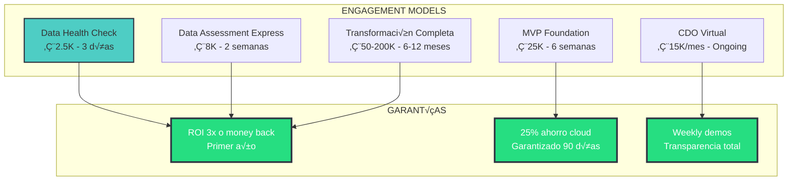
```mermaid
graph TB
    subgraph "ENGAGEMENT MODELS"
        A[Data Health Check<br/>€2.5K - 3 días]
        B[Data Assessment Express<br/>€8K - 2 semanas]
        C[MVP Foundation<br/>€25K - 6 semanas]
        D[CDO Virtual<br/>€15K/mes - Ongoing]
        E[Transformación Completa<br/>€50-200K - 6-12 meses]
    end
    
    subgraph "GARANTÍAS"
        F[ROI 3x o money back<br/>Primer año]
        G[25% ahorro cloud<br/>Garantizado 90 días]
        H[Weekly demos<br/>Transparencia total]
    end
    
    A --> F
    B --> F
    C --> G
    D --> H
    E --> F
    
    style A fill:#4ecdc4,stroke:#2f3542,stroke-width:2px
    style F fill:#26de81,stroke:#2f3542,stroke-width:3px,color:#fff
    style G fill:#26de81,stroke:#2f3542,stroke-width:3px,color:#fff
    style H fill:#26de81,stroke:#2f3542,stroke-width:3px,color:#fff
```

**Nuestro compromiso: Si no generas 3x ROI en el primer año, te devolvemos el dinero.**

*Comentario de posicionamiento: Cuidado con parecer "too big" para PMEs. El 80% de empresas exceden presupuestos cloud. Mejor enfocar en "Transformación escalable por fases" para reducir percepción de riesgo.*

### C. DIFERENCIALES SPHERED

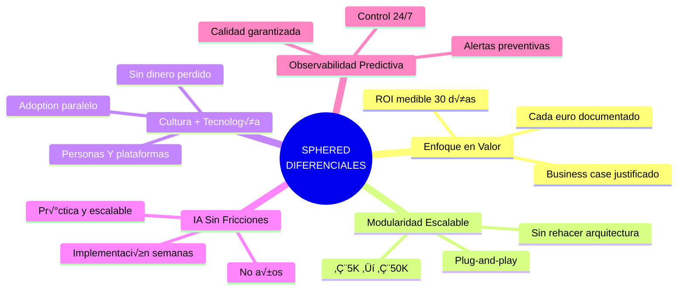
```mermaid
mindmap
  root((SPHERED<br/>DIFERENCIALES))
    Enfoque en Valor
      ROI medible 30 días
      Business case justificado
      Cada euro documentado
    Modularidad Escalable
      Plug-and-play
      €5K → €50K
      Sin rehacer arquitectura
    Cultura + Tecnología
      Personas Y plataformas
      Adoption paralelo
      Sin dinero perdido
    IA Sin Fricciones
      Implementación semanas
      No años
      Pr√°ctica y escalable
    Observabilidad Predictiva
      Alertas preventivas
      Control 24/7
      Calidad garantizada
```

**‚ñ™ Enfoque en valor**
"Cada euro invertido tiene un caso de negocio documentado y validado. No arrancamos sin ROI esperado."

*Comentario crítico: Esto lo dice todo el mundo. El diferencial real debe ser "ROI medible en 30 días" o "Business case justificado antes de cada euro invertido". Las PMEs necesitan justificación inmediata, no promesas.*

**‚ñ™ Modularidad escalable**
"Arquitectura plug-and-play que crece contigo: empieza en €5K, escala sin rehacer nada hasta €50K."

*Comentario técnico: Esto es GOLD puro. El 70% de proyectos data fallan por over-engineering inicial. Sin embargo, falta especificidad. Sugiero: "Arquitectura modular que crece contigo: desde €5K/mes hasta €50K/mes sin rehacerlo"*

**▪ Cultura + Tecnología**
"Transformamos personas Y plataformas en paralelo — porque la tecnología sin adoption es dinero perdido."

*Comentario de diferenciación: Este es tu OCÉANO AZUL. La competencia hace tech O cultura, nunca ambos simultáneamente. Pero necesita más punch. Sugiero: "Transformamos personas Y plataformas en paralelo - porque la tecnología sin adoption es dinero perdido".*

**‚ñ™ IA integrada sin fricciones**
"IA práctica implementada en semanas, no años."

*Comentario de mercado: El mercado GenAI crecerá 40% CAGR hasta 2029. Pero "día 1" suena overselling. Mejor: "IA práctica implementada en semanas, no años" - más creíble para PMEs escépticas.*

**‚ñ™ Observabilidad predictiva**
"Alertas antes de que tus datos fallen. Calidad, uso y costes bajo control 24/7."

*Comentario estratégico: ESTO ES CLAVE. El mercado observabilidad crece 12.2% y será $2.14B. Para PMEs, esto resuelve el pánico de "¿están funcionando mis datos?". Sugiero añadir: "Alertas predictivas antes de que falles" - más tangible.*

### D. EJEMPLOS DE SERVICIOS

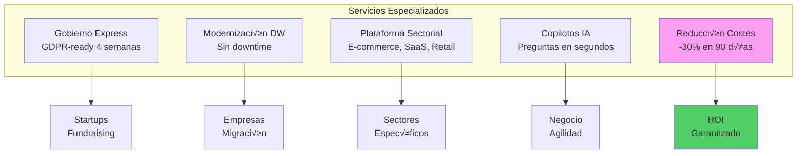
```mermaid
graph TB
    subgraph "Servicios Especializados"
        A[Gobierno Express<br/>GDPR-ready 4 semanas]
        B[Modernización DW<br/>Sin downtime]
        C[Plataforma Sectorial<br/>E-commerce, SaaS, Retail]
        D[Copilotos IA<br/>Preguntas en segundos]
        E[Reducción Costes<br/>-30% en 90 días]
    end
    
    A --> F[Startups<br/>Fundraising]
    B --> G[Empresas<br/>Migración]
    C --> H[Sectores<br/>Específicos]
    D --> I[Negocio<br/>Agilidad]
    E --> J[ROI<br/>Garantizado]
    
    style E fill:#ff9ff3
    style J fill:#51cf66
```

- Gobierno del dato express para startups: GDPR-ready en 4 semanas para tu próxima ronda de inversión.

*Comentario de nicho: Perfecto targeting. Startups necesitan compliance rápido para fundraising. Sugiero especificar: "GDPR-ready en 4 semanas para tu próxima ronda de inversión".*

- Modernización de DW sin downtime: tus reports siguen funcionando durante la migración.

*Comentario de mercado: El mercado DWaaS crecerá $37.84B para 2034. Pero "migración" asusta a PMEs. Mejor: "Modernización sin downtime - tus reports siguen funcionando mientras migramos por detrás".*

- Plataforma específica por sector: E-commerce (customer 360), SaaS (churn prediction), Retail (demand forecast).

*Comentario de especificidad: Muy genérico. Sugiero segmentar: "Plataforma e-commerce: customer 360° en 6 semanas" o "Plataforma SaaS: churn prediction operativo".*

- Activación de copilotos IA: asistentes que responden preguntas de negocio en segundos.

*Comentario de tendencia: El mercado GenAI en analytics será $12.45B en 2034. Pero PMEs no saben qué es un "copiloto". Mejor: "Asistente IA que responde preguntas de negocio en segundos".*

- Reducción de costes cloud: ahorro garantizado del 20–30% en 90 días.

*Comentario de oro: ESTO ES TU TROJAN HORSE comercial. Las empresas desperdician 32% presupuesto cloud. PMEs pueden ahorrar €50–200K anuales. Sugiero liderar con esto: "Reduce tus costes cloud 30% en 90 días - garantizado".*

### E. IMPACTO PROMETIDO (CON KPIs)

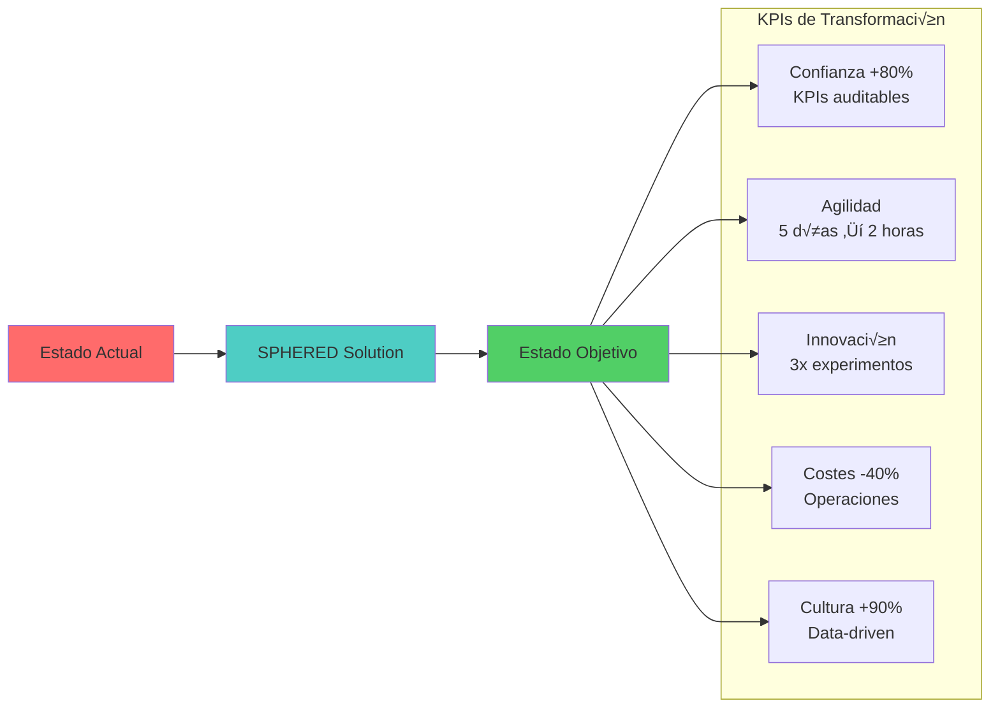
```mermaid
graph LR
    A[Estado Actual] --> B[SPHERED Solution] --> C[Estado Objetivo]
    
    subgraph "KPIs de Transformación"
        D[Confianza +80%<br/>KPIs auditables]
        E[Agilidad<br/>5 días → 2 horas]
        F[Innovación<br/>3x experimentos]
        G[Costes -40%<br/>Operaciones]
        H[Cultura +90%<br/>Data-driven]
    end
    
    C --> D
    C --> E
    C --> F
    C --> G
    C --> H
    
    style A fill:#ff6b6b
    style B fill:#4ecdc4
    style C fill:#51cf66
```

- Confianza en la información: +80% de KPIs auditables y trazables en 60 días.

*Comentario de dolor: Solo 33% de empresas confían en sus datos. Pero "mayor confianza" es intangible. Mejor: "95% de decisiones respaldadas por datos verificados".*

- Agilidad en decisiones: reducción del ciclo de análisis de 5 días a 2 horas promedio.

*Comentario de velocidad: Perfecto pain point. Sugiero cuantificar: "De días a minutos para obtener insights críticos".*

- Aceleración de innovación: triplicamos los experimentos de producto por trimestre.

*Comentario de valor: Muy abstracto. Mejor: "Lanza 3x m√°s experimentos de producto por trimestre".*

- Costes optimizados: ahorro del 20–40% en operaciones y 50% menos tiempo en reportes manuales.

*Comentario crítico: Aquí está el ROI. Las PMEs necesitan números: "20–40% reducción costes operativos data" o "50% menos tiempo en reportes manuales".*

- Cultura data-driven: +90% de empleados usan datos para decidir en 6 meses.

*Comentario cultural: Solo 50% de PMEs tienen cultura data-driven. Sugiero: "90% de empleados toman decisiones con datos en 6 meses".*

## COMENTARIOS GENERALES ESTRATÉGICOS

**Posicionamiento de mercado:**
El mercado de consultoría en Big Data proyecta un crecimiento de $150B con un CAGR del 15%. Sin embargo, el 60% está en manos de las Big Four. Aquí se abre tu oportunidad: posicionarte como una "boutique especializada que democratiza el acceso a datos" — una tendencia crítica para 2025.

**Dolor crítico no mencionado:**
FinOps es el dolor silencioso más grande. Las empresas desperdician un 32% de su presupuesto cloud. En el caso de las PMEs españolas, eso equivale a entre €50K y €200K anuales. Convierte FinOps en tu caballo de Troya comercial.

**Urgencia regulatoria:**
Con el AI Act en vigor, se abre una ventana temporal: las empresas necesitan urgentemente incorporar "gobernanza de IA". Muy pocos consultores lo ofrecen aún. Es un océano azul para capturar.

**Personalización local:**
Las PMEs españolas no quieren más discursos Silicon Valley. Quieren realidades tangibles: casos de éxito en empresas valencianas, cumplimiento específico español y precios adaptados al mercado ibérico.

**Gap competitivo:**
Ningún competidor importante ofrece el paquete integrado de "democratización + proximidad + expertise técnico + cultura". Ese es tu océano azul. Ocúpalo con fuerza.

## RECOMENDACIONES ESTRATÉGICAS FINALES

**Gap competitivo identificado:** Ningún competidor ofrece "FinOps + Data + Culture" como paquete integrado para PMEs españolas. Ese es tu territorio virgen.

**Propuesta de valor killer:** "Ahorra €100K+ en cloud mientras construyes tu plataforma de datos - sin contratar CDO ni Data Engineers".

**Urgencia regulatoria:** AI Act + GDPR crean una ventana de oportunidad temporal. Las PMEs necesitan compliance urgente — posiciónate como "el especialista que evita multas".

**Mensaje emocional:** "Deja de tomar decisiones a ciegas. Nosotros convertimos tus datos en tu ventaja competitiva m√°s poderosa".

---

## üö® CALL TO ACTION SPHERED

### EL MOMENTO ES AHORA

**Por qué actuar YA:**
- **AI Act**: Compliance obligatorio desde febrero 2024 - €35M multa máxima
- **Cloud waste**: Cada mes que pasa pierdes €5-15K en ineficiencias 
- **Competencia**: Tus competidores est√°n moviendo. Los que no se muevan, mueren.
- **Talento**: El coste de Data Engineers subió 40% en 2024. Nosotros lo resolvemos.

### TU PRÓXIMO PASO

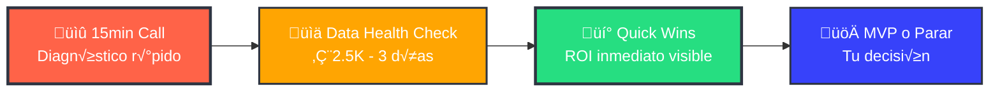
```mermaid
flowchart LR
    A[📞 15min Call<br/>Diagnóstico rápido] --> B[📊 Data Health Check<br/>€2.5K - 3 días]
    B --> C[üí° Quick Wins<br/>ROI inmediato visible]
    C --> D[🚀 MVP o Parar<br/>Tu decisión]
    
    style A fill:#ff6348,stroke:#2f3542,stroke-width:3px,color:#fff
    style B fill:#ffa502,stroke:#2f3542,stroke-width:2px,color:#fff
    style C fill:#26de81,stroke:#2f3542,stroke-width:3px,color:#fff
    style D fill:#3742fa,stroke:#2f3542,stroke-width:2px,color:#fff
```

**Contacto directo: [email/teléfono] - Respuesta en <24h**

### GARANTÍA SPHERED

> **"Si en 90 días no has ahorrado al menos €25K en costes cloud O no ves ROI tangible en tus decisiones, te devolvemos el 100% de lo invertido. Sin preguntas. Sin letra pequeña."**

**No hay riesgo para ti. Todo el riesgo lo asumimos nosotros.**

---

*"El futuro pertenece a las empresas que toman decisiones con datos, no con intuición. ¿De qué lado de la historia quieres estar?"*

---

## PROPUESTA DE VALOR SPHERED

**"Ahorra €100K en cloud, toma decisiones en minutos y cumple con la ley de IA — sin contratar un equipo de datos."**

## POSICIONAMIENTO

**Quiénes somos:**
Boutique especializada en datos para PMEs. Democratizamos el acceso a la inteligencia empresarial con tecnología, cultura y eficiencia en costes.

**Nuestro diferencial:**
FinOps + Data Platform + Cultura, todo en un √∫nico servicio modular.

**Nuestro mensaje emocional:**
"Deja de tomar decisiones a ciegas. Nosotros convertimos tus datos en tu ventaja competitiva m√°s poderosa."
